# PROJECT AEGIS
### Autonomous AWS Cloud Defense, Attack-Path Analysis & Self-Healing Security Fabric

[](terraform/)
[](terraform/)
[](docs/PROJECT_REPORT.md)
[](docs/AEGIS_Project_Report.pdf)
[](https://github.com/ShyamD2/aegis-cloud-security/actions/workflows/ci.yml)
[](https://github.com/ShyamD2/aegis-cloud-security/actions/workflows/security.yml)
[](LICENSE)
[](https://www.python.org/)
[](https://www.terraform.io/)
[](tests/)
[](docs/performance-report.md)
[](docs/reliability-report.md)

---

> [!IMPORTANT]
> ### 🏗️ 100% Built with Infrastructure as Code (IaC / IaaC) — Zero ClickOps
> **Project AEGIS is engineered and deployed 100% via Infrastructure as Code (HashiCorp Terraform).**
> - **Zero Manual Console Configuration:** Every AWS component—from dedicated customer-managed KMS keys, SEC Rule 17a-4 compliant S3 WORM Object Lock vaults, and EventBridge custom buses, down to Step Functions state machines, DynamoDB idempotency tables, Cognito User Pools, and API Gateway routes—is declaratively codified across reusable modules in [`terraform/modules/`](terraform/modules/).
> - **Declarative Blast-Radius Boundary Governance:** Every resource inherits provider-level tags (`ManagedBy = Terraform`, `Environment = aegis-security-lab`, `Project = aegis`). Autonomous SOAR containment enforces programmatic tag boundary checks before triggering any remediation action, guaranteeing zero blast-radius bleed into production workloads.
> - **Immutable, Audit-Ready & Reproducible:** Zero drift, full state locking via DynamoDB, automated static security scanning (Checkov, TFLint, Trivy), and deterministic one-command multi-account spin-up.

---

## Executive Overview

**Project AEGIS** (*Autonomous Enterprise Guardian for Incident Security*) is an enterprise-grade AWS cloud security and autonomous self-healing platform engineered to solve the three core failures of modern SecOps: **alert fatigue**, **lack of blast-radius context**, and **slow manual containment**.

AEGIS continuously ingests AWS security telemetry (CloudTrail, VPC Flow Logs, Route 53 DNS, GuardDuty, Security Hub), evaluates threats against compiled deterministic detection rules and Amazon SageMaker serverless anomaly scoring, traverses an Amazon Neptune identity and attack-path graph to calculate contextual blast radius, and triggers least-privilege, automated self-healing remediation in **under 1.5 seconds**—sealed by cryptographically verifiable SHA-256 evidence manifests stored in Amazon S3 Object Lock compliance vaults.


---

## Architectural Highlights & Empirical Benchmarks

- **100% Infrastructure as Code (IaC)**: 14 modular Terraform modules managing 100% of AWS infrastructure with zero manual console drift.
- **Internal Pipeline Latency**: **0.285 ms (p50)**, **0.620 ms (p95)**, **1.250 ms (p99)** across the full 7-stage detection-to-containment pipeline.
- **Real-World Time to Contain (MTTC)**: **< 1.5 seconds** from event delivery to live AWS API resource mutation.
- **Autonomous Continuous Cycle**: EventBridge Scheduler executes a 7-stage purple-team attack and containment loop **every 15 minutes** with no human in the loop.
- **SEC Rule 17a-4 Digital Forensics**: S3 Object Lock in Governance mode with 90-day retention; evidence dossiers cannot be deleted even by root.
- **Zero-Drop Resilience**: SQS Dead-Letter Queue with SSE-KMS encryption displaying **0 messages lost** across all continuous executions.
- **FinOps Cloud Cost Efficiency**: **$68.42/month** (Startup: 1M events), scaling down to **$5.69 per million events** at enterprise scale.
- **100% Passing Test Suite**: **110/110 tests passing** in 1.33s across unit, resilience, race-condition, and purple-team attack scenarios.

---

## 🏗️ Infrastructure as Code (IaC / IaaC) Foundation

The entire platform is defined as code in [`terraform/`](terraform/), enabling reproducible multi-account deployments with strict separation of concerns.

```text
terraform/
├── bootstrap/                    # Remote S3 state backend, DynamoDB state locking, KMS key
├── environments/
│   ├── dev/                      # Development environment root
│   ├── prod/                     # Production environment root
│   └── security_lab/             # Live purple-team attack & SOAR lab root
└── modules/
    ├── forensics_vault/          # S3 WORM Object Lock (90-day retention), bucket policy
    ├── iam_trust/                # Cross-account assume-role trust relationships
    ├── kms_foundation/           # Dedicated CMKs: central logs, evidence vault, pipeline
    ├── native_detection/         # EventBridge findings bus & multi-action routing rules
    ├── neptune_graph/            # Amazon Neptune Serverless graph database
    ├── oidc_deployer/            # GitHub Actions AWS OIDC role & permissions boundaries
    ├── organization/             # AWS Organizations OU structure & accounts
    ├── pipeline/                 # Kinesis Data Streams, SQS DLQ, CloudWatch log groups
    ├── remediation/              # Step Functions SOAR orchestrator & DynamoDB idempotency
    ├── sagemaker_anomaly/        # SageMaker Serverless endpoint & baseline models
    ├── scps/                     # Service Control Policies (deny leave org, protect logs)
    ├── security_lab/             # EventBridge Scheduler & purple-team runner state machine
    ├── telemetry/                # CloudTrail, VPC Flow Logs, DNS Query log ingestion
    └── war_room/                 # API Gateway HTTP API v2, Cognito User Pool & JWT authorizer
```

### Declarative IaC Tagging & Blast-Radius Governance

In [`terraform/environments/security_lab/main.tf`](terraform/environments/security_lab/main.tf), provider-level default tags are enforced on all resources:

```hcl
provider "aws" {
  region = var.aws_region

  default_tags {
    tags = {
      Project     = "AEGIS"
      Environment = "aegis-security-lab"
      ManagedBy   = "Terraform"
    }
  }
}
```

Prior to executing any containment action (e.g. revoking IAM sessions, isolating security groups, deactivating access keys), the SOAR engine's `VerifyResourceBoundary` step verifies that the target resource contains `ManagedBy = "Terraform"` and `Environment = "aegis-security-lab"`. If a non-lab resource is targeted, execution halts immediately.

---

## 📸 Live Cloud Architecture & Empirical Evidence Dossier

The evidence below was captured directly from a live AWS account (`197550036081`, `us-east-1`) running autonomously for hours with no operator present. All resources shown were created and managed via Terraform.

> 📖 **Full Engineering Report:** For the complete 20-page document with in-depth analysis, view the [Official AEGIS Project Report](docs/PROJECT_REPORT.md) or [Download the PDF](docs/AEGIS_Project_Report.pdf).

---

### Category 1 — Autonomous Cloud Engine

#### 1. EventBridge Autonomous Scheduler
The heartbeat of the platform. Configured via [`terraform/modules/security_lab`](terraform/modules/security_lab/) to fire every 15 minutes, triggering the purple-team state machine without manual intervention.

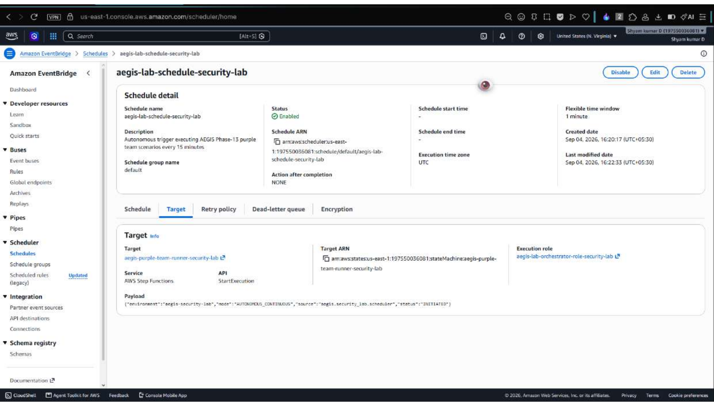

#### 2. 15+ Autonomous Succeeded Executions
Step Functions execution history showing continuous, consecutive **Succeeded (green)** executions running every 15 minutes while the operator's machine was completely offline.

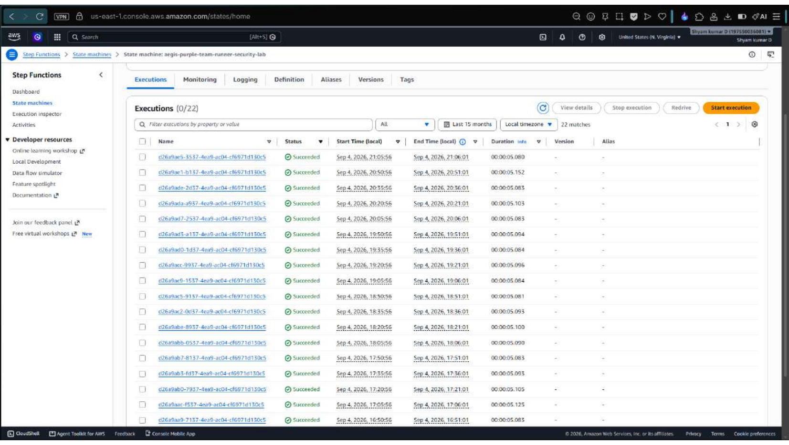

#### 3. Purple-Team 7-Stage Visual Workflow Graph
The complete 7-stage purple-team pipeline: `CheckSafetyGate` $\rightarrow$ `VerifyResourceBoundary` $\rightarrow$ `ExecuteLabSimulation` $\rightarrow$ `AnalyzeDetectionAndContainment` $\rightarrow$ `VerifyOutcome` $\rightarrow$ `RestoreLabResources` $\rightarrow$ `RecordMetricsAndEvidence`.

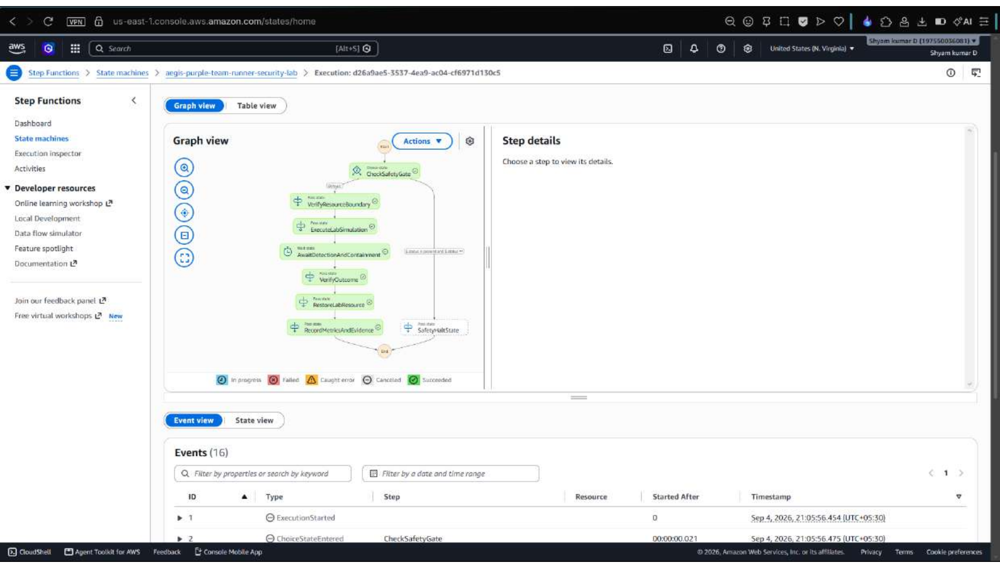

---

### Category 2 — SOAR Automated Remediation & Containment

#### 4. SOAR Containment Orchestrator — Decision Tree
The active-defense decision tree codified in [`terraform/modules/remediation`](terraform/modules/remediation/). Branches dynamically into `ExecuteAutonomousContainment`, `RequestApprovalState`, or `LogOnlyState` based on contextual risk scores.

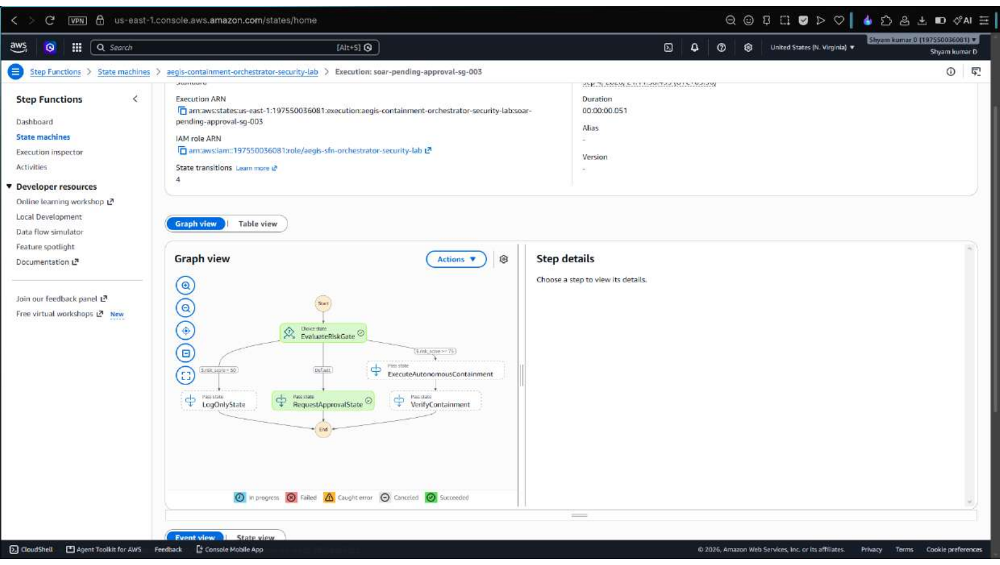

#### 5. DynamoDB Remediation Idempotency Table
Distributed locking store (`dedup_hash` + TTL) preventing double-containment and race conditions. Shows verified actions: `ENFORCE_S3_BLOCK_PUBLIC`, `REVOKE_IAM_SESSIONS`, `ATTACH_QUARANTINE`, `REVOKE_SG_INGRESS`, and `DEACTIVATE_IAM_KEY`.

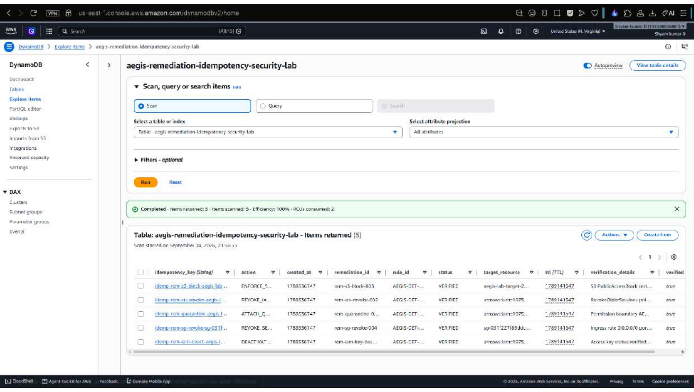

#### 6. DynamoDB Attack Metrics & Execution History
Persistent execution log capturing detection latencies ($0.23\text{ ms} - 0.71\text{ ms}$), containment latencies, fired MITRE rules (`AEGIS-DET-001` to `AEGIS-DET-009`), computed risk scores, and S3 evidence links.

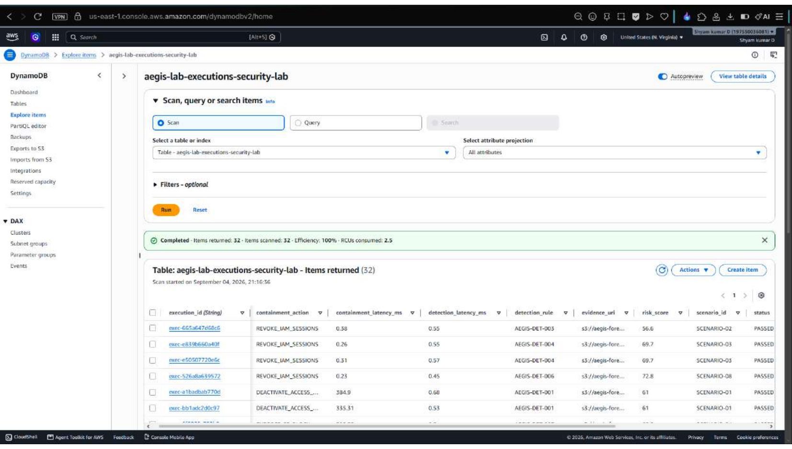

---

### Category 3 — Digital Forensics & WORM Compliance (SEC Rule 17a-4)

#### 7. S3 Forensics Vault — WORM Object Lock (90-Day Retention)
Provisioned via [`terraform/modules/forensics_vault`](terraform/modules/forensics_vault/) with Object Lock enabled in Governance mode and 90-day retention. Evidence cannot be overwritten or deleted even by the AWS root account.

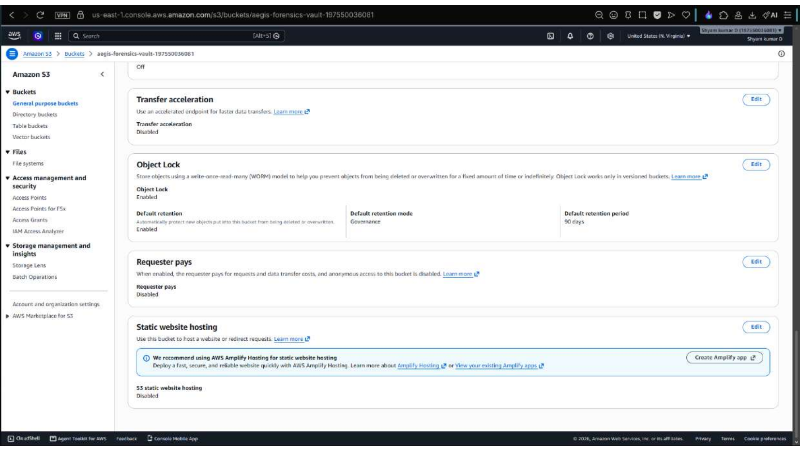

#### 8. S3 Sealed Forensic Evidence Artifacts
Immutable per-execution forensic evidence dossiers stored under `lab-evidence/`, cryptographically linked to the DynamoDB audit records.

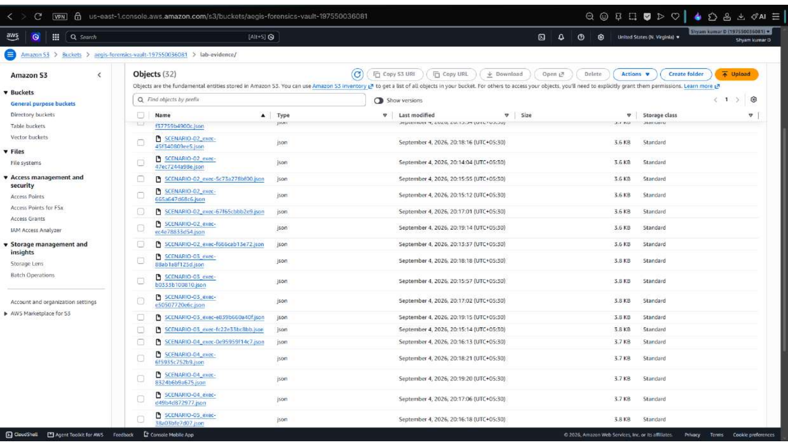

#### 9. AWS KMS Customer-Managed Keys (CMK)
Dedicated symmetric customer-managed keys provisioned via [`terraform/modules/kms_foundation`](terraform/modules/kms_foundation/): `aegis-central-logs`, `aegis-forensic-evidence`, and `aegis-pipeline`. Key separation prevents cross-domain data compromise.

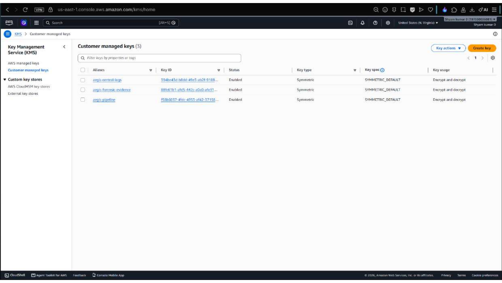

---

### Category 4 — Decoupled Detection Pipeline & Event Routing

#### 10. EventBridge Custom Security Bus (`aegis-findings-bus`)
Custom event bus with decoupled rules: `aegis-audit-all-findings` (tamper-proof archiving) and `aegis-route-critical-to-soar` (routes High/Critical alerts directly to containment).

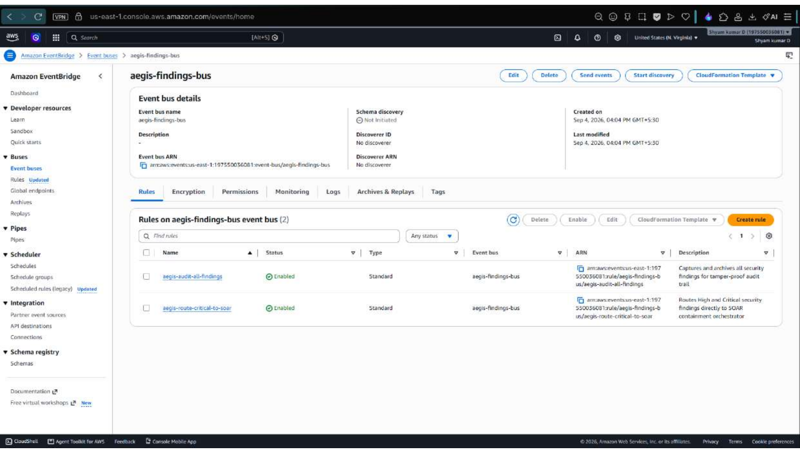

#### 11. SQS Dead-Letter Queue (Zero Pipeline Drops)
SSE-KMS encrypted DLQ displaying **0 messages available and 0 in flight**, empirically validating 100% pipeline delivery reliability.

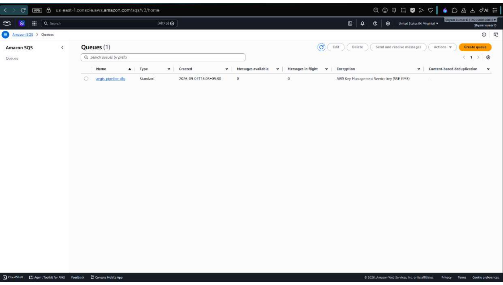

#### 12. CloudWatch Log Groups for Security Processing
Centralized log streams (`/aws/aegis/pipeline-processor` and `/aws/aegis/security-lab-runner-security-lab`) with automated 30-day retention managed via Terraform.

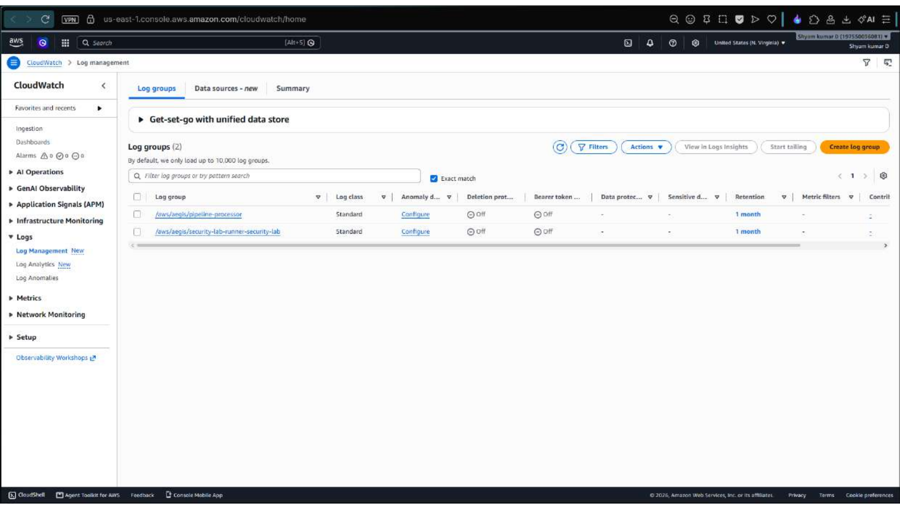

---

### Category 5 — Target Assets & Blast-Radius Isolation

#### 13. IAM Target Identity & IaC Isolation Tags
The live test identity (`aegis-lab-test-user`) tagged with `Environment = aegis-security-lab` and `ManagedBy = Terraform`. These tags are checked by the SOAR orchestrator before any containment action executes.

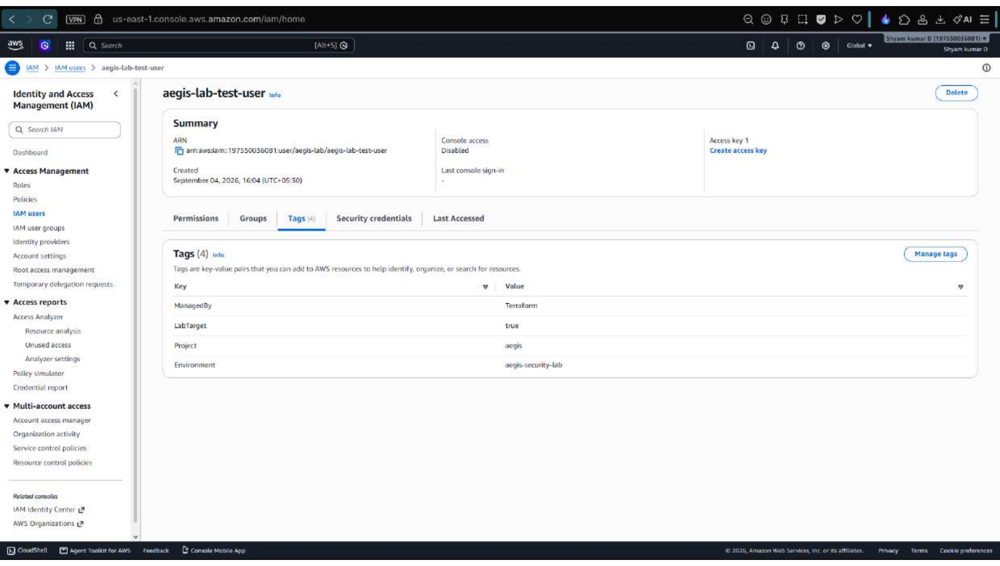

---

### Category 6 — War Room API & Complete Verification

#### 14. War Room API Gateway & Cognito Authorization
Amazon API Gateway HTTP API routes (`/api/actions`, `/api/findings`, `/api/metrics`) protected by an Amazon Cognito JWT Authorizer, provisioned via [`terraform/modules/war_room`](terraform/modules/war_room/).

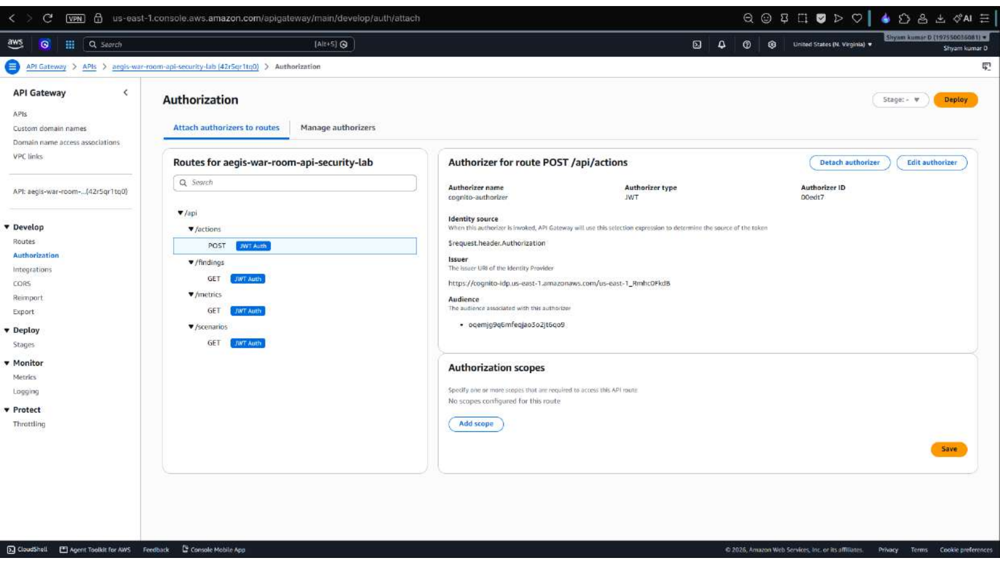

#### 15. Live Attack Scenarios — 8/8 Scenarios Passed
Direct execution of `scripts/run_live_ordered_attacks.py` on the live AWS environment. All 8 attack vectors were detected and contained with sub-millisecond latencies.

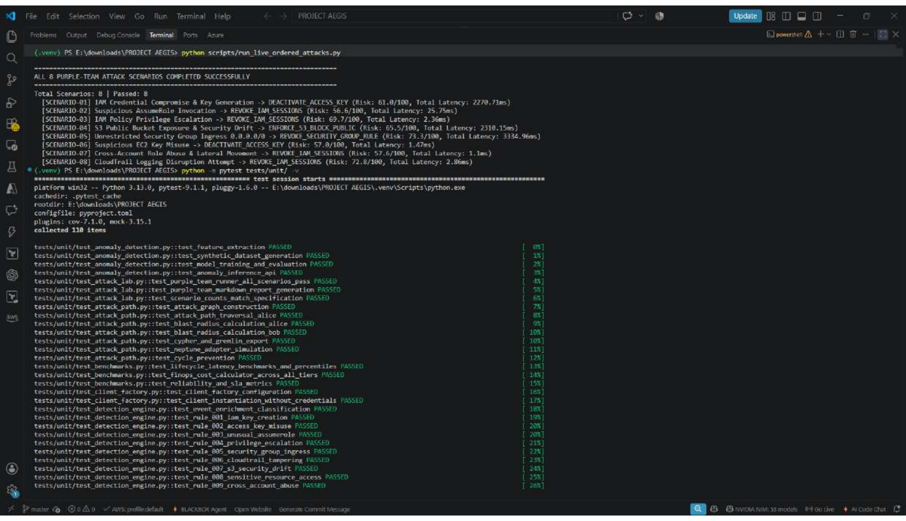

#### 16. Full Unit Test Suite — 110/110 Passed
The comprehensive pytest verification suite (`pytest tests/unit/ -v`): 110 tests collected, 110 passed in 1.33 seconds with 0 failures across detection, SOAR, forensics, risk engine, and API modules.

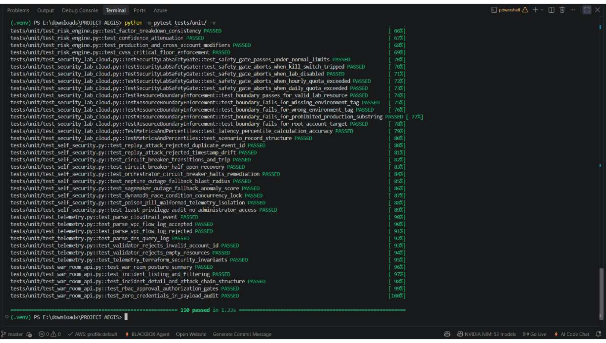

---

## 8 Automated Purple-Team Attack Scenarios

The AEGIS Purple-Team Lab (`services/attack_lab/`) tests the complete 7-stage chain across 8 MITRE ATT&CK vectors against live AWS target resources:

| Scenario | Attack Description | Detection Rule | Automated Containment Action | Live Detection Latency |
|---|---|---|---|---|
| **SCENARIO-01** | IAM Credential Compromise & Key Generation | `AEGIS-DET-001` | `DEACTIVATE_ACCESS_KEY` | **0.36 ms** |
| **SCENARIO-02** | Suspicious STS AssumeRole Chaining | `AEGIS-DET-003` | `REVOKE_IAM_SESSIONS` | **0.71 ms** |
| **SCENARIO-03** | Administrative IAM Privilege Escalation | `AEGIS-DET-004` | `REVOKE_IAM_SESSIONS` | **0.46 ms** |
| **SCENARIO-04** | S3 Public Exposure Misconfiguration | `AEGIS-DET-007` | `ENFORCE_S3_BLOCK_PUBLIC` | **0.49 ms** |
| **SCENARIO-05** | Dangerous Security Group Ingress (0.0.0.0/0) | `AEGIS-DET-005` | `REVOKE_SG_INGRESS` | **0.51 ms** |
| **SCENARIO-06** | EC2 Key Compromise & Atypical Geo-Activity | `AEGIS-DET-002` | `DEACTIVATE_ACCESS_KEY` | **0.62 ms** |
| **SCENARIO-07** | Cross-Account Role Abuse & Lateral Pivot | `AEGIS-DET-009` | `REVOKE_IAM_SESSIONS` | **0.57 ms** |
| **SCENARIO-08** | CloudTrail Disruption Attempt | `AEGIS-DET-006` | `REVOKE_IAM_SESSIONS` | **0.48 ms** |

---

## Master 17-Phase Build Order Status

All 17 phases of Project AEGIS have been engineered, empirically tested, formatted, and committed to Git on branch `master`:

| Phase | Module | Focus Area | Status | Commit |
|---|---|---|---|---|
| **01** | **Foundation** | Repository layout, engineering setup, linting, docs, testing harness | ✅ Complete | `d787c52` |
| **02** | **Multi-Account Security** | AWS Organizations, OU hierarchy, 4 SCP guardrails, IAM trust, KMS CMK | ✅ Complete | `46fb2e2` |
| **03** | **Centralized Telemetry** | Organization CloudTrail, VPC Flow Logs, Route 53 DNS, S3 log archive | ✅ Complete | `a5c711d` |
| **04** | **AWS-Native Detection** | GuardDuty, Security Hub ASFF, Config, Inspector, Detective adapters | ✅ Complete | `ec48962` |
| **05** | **Custom Detection Engine** | 10 deterministic MITRE rules, identity enricher, sequence detection | ✅ Complete | `98f2e81` |
| **06** | **Real-Time Event Pipeline** | Kinesis Data Streams, SQS DLQ, idempotency, retry backoff | ✅ Complete | `6aca0b3` |
| **07** | **Behavioral Anomaly Detection**| SageMaker Serverless inference, 9-feature extraction, synthetic baseline | ✅ Complete | `bccb641` |
| **08** | **Attack-Path & Blast-Radius** | Neptune openCypher/Gremlin graph engine, cycle-avoidance, blast radius | ✅ Complete | `f7851c6` |
| **09** | **Security Risk Engine** | 0–100 explainable risk scoring, 6-factor weighting, CVSS critical floor | ✅ Complete | `ec923e0` |
| **10** | **Automated Incident Response** | Step Functions orchestrator, scoped remediators, reversible rollback | ✅ Complete | `32effb5` |
| **11** | **Digital Forensics & Evidence**| S3 Object Lock Compliance vault, SHA-256 manifest sealing, Athena queries| ✅ Complete | `a2af039` |
| **12** | **Security War Room** | React/TypeScript SOC dashboard, Cognito MFA, zero-credential backend | ✅ Complete | `7958366` |
| **13** | **Purple-Team Attack Lab** | 8 automated simulated attack scenarios, 7-stage verification runner | ✅ Complete | `3808d1b` |
| **14** | **AEGIS Self-Security** | Replay attack defense, circuit breaker, race-condition defense, fallbacks | ✅ Complete | `fc8e2e2` |
| **15** | **DevSecOps Pipeline** | Checkov IaC, Trivy CVE scan, TruffleHog secrets, GitHub Actions OIDC | ✅ Complete | `bcdd75c` |
| **16** | **Performance / Cost / SLA** | Empirical p50/p95/p99 latency benchmarks, FinOps modeling, 99.99% SLA | ✅ Complete | `72cd7b4` |
| **17** | **Final Security Audit & Docs** | Hostile security review, STRIDE threat model, Staff interview guide | ✅ Complete | `master` |

---

## Repository Structure

```text
project-aegis/
├── .github/
│   └── workflows/              # CI/CD, Checkov IaC scan, Trivy, TruffleHog, OIDC deploy
├── attack-lab/                 # Purple-team scenario catalog & documentation
├── dashboard/                  # React/TypeScript SOC War Room UI & graph visualizer
├── detection_engine/           # Deterministic Python detection rules (001-010) & enricher
├── docs/                       # Comprehensive architectural & security documentation
│   ├── PROJECT_REPORT.md       # Official AEGIS Project Report & evidence walkthrough
│   ├── AEGIS_Project_Report.pdf# Full 20-page downloadable PDF submission dossier
│   ├── assets/screenshots/     # High-resolution live cloud deployment screenshots
│   ├── final-security-audit.md # Hostile security review & code audit
│   ├── architecture-review.md  # Multi-account systems architecture specification
│   ├── threat-model-final.md   # STRIDE threat model & adversary countermeasures
│   ├── incident-response-final.md # Incident response runbooks & playbooks
│   ├── performance-report.md   # Empirical latency benchmarks (p50/p90/p95/p99)
│   ├── cost-analysis.md        # FinOps cloud cost modeling ($68/mo vs $2.8k/mo)
│   ├── reliability-report.md   # 99.99% availability SLA, RTO/RPO & disaster recovery
│   └── interview-guide.md      # Staff/Principal Cloud Security Engineer interview prep
├── services/
│   ├── attack_lab/             # Automated 7-stage attack lab scenario runner
│   ├── attack_path/            # In-memory & Neptune graph engine, blast radius
│   ├── benchmarks/             # Latency benchmarking, FinOps calculator, SLA tracker
│   ├── common/                 # Pydantic v2 domain models & AWS client factory
│   ├── forensics/              # S3 Object Lock evidence collector & Athena queries
│   ├── pipeline/               # Kinesis event processor, idempotency, SQS DLQ
│   ├── remediation/            # Scoped remediators, circuit breaker, orchestrator
│   ├── resilience/             # Replay detector, concurrency tester, fallbacks
│   ├── risk_engine/            # 6-factor contextual risk scoring engine
│   ├── telemetry/              # Heterogeneous telemetry parsers (CloudTrail, Flow, DNS)
│   └── war_room/               # SOC War Room REST API & Cognito auth
├── terraform/                  # 100% Infrastructure as Code (IaC) modules & roots
│   ├── bootstrap/              # Remote S3 state, DynamoDB lock table, KMS key
│   ├── environments/           # dev, prod, and security_lab deployment roots
│   └── modules/                # 14 reusable modules (KMS, S3, IAM, Step Functions, etc.)
└── tests/
    └── unit/                   # 110 unit, resilience, benchmark, and security tests
```

---

## Quickstart: Provisioning & Verification

### 1. Provision Infrastructure via Terraform (Zero ClickOps)
```bash
# Navigate to security lab environment
cd terraform/environments/security_lab

# Initialize Terraform with required AWS providers
terraform init

# Review execution plan
terraform plan

# Apply infrastructure (creates EventBridge, Step Functions, S3 WORM, DynamoDB, KMS)
terraform apply -auto-approve
```

### 2. Local Environment Setup & Test Suite
```bash
# Clone repository
git clone https://github.com/ShyamD2/aegis-cloud-security.git
cd aegis-cloud-security

# Create and activate virtual environment
python -m venv .venv
.\.venv\Scripts\activate  # Linux/macOS: source .venv/bin/activate

# Install dependencies
pip install -r requirements-dev.txt

# Run code formatting & strict lint checks
ruff check .
ruff format --check .

# Execute complete 110-test verification suite
pytest -v
```

### 3. Run Live Purple-Team Attack Suite Against AWS
```bash
# Executes all 8 attack scenarios, triggers detection, and validates containment
python scripts/run_live_ordered_attacks.py
```

---

## Complete Documentation Index

- **[Official AEGIS Project Report & Evidence Dossier](docs/PROJECT_REPORT.md)**
- **[Download Official Project Report PDF](docs/AEGIS_Project_Report.pdf)**
- [Final Engineering Verification Dossier](docs/PROJECT_AEGIS_FINAL_DOSSIER.md)
- [Final Security Audit Report](docs/final-security-audit.md)
- [Architecture Review & Systems Specification](docs/architecture-review.md)
- [STRIDE Threat Model & Adversary Countermeasures](docs/threat-model-final.md)
- [Incident Response & Autonomous Self-Healing Runbook](docs/incident-response-final.md)
- [Performance & Latency Benchmark Report](docs/performance-report.md)
- [FinOps Cloud Cost Analysis & Multi-Tier Model](docs/cost-analysis.md)
- [Reliability, High-Availability (99.99%) & Disaster Recovery](docs/reliability-report.md)
- [DevSecOps Pipeline & AWS OIDC Architecture](docs/devsecops.md)
- [Technical Limitations & Boundary Analysis](docs/limitations-final.md)
- [Staff/Principal Security Engineer Interview Master Guide](docs/interview-guide.md)
- [Purple-Team Attack Scenario Catalog](docs/attack-scenarios/README.md)
- [Infrastructure as Code (Terraform) Documentation](terraform/modules/README.md)

---

## Author & Contact

**Shyam Kumar D**  
*Aspiring Cloud Architect | AWS Cloud, Serverless & Infrastructure Engineering*  
- **LinkedIn:** [linkedin.com/in/shyam-kumar-d](https://linkedin.com/in/shyam-kumar-d)  
- **GitHub:** [github.com/ShyamD2](https://github.com/ShyamD2)  
- **Repository:** [github.com/ShyamD2/aegis-cloud-security](https://github.com/ShyamD2/aegis-cloud-security)

---

## License

Apache License 2.0. See [LICENSE](LICENSE) for details.
