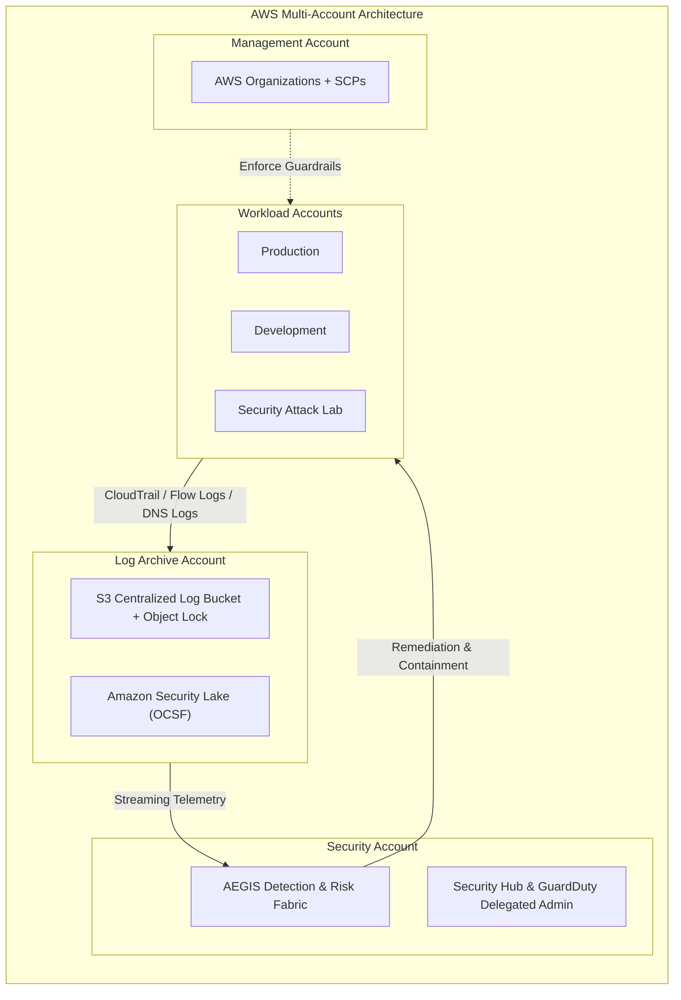

# PROJECT AEGIS
### Autonomous AWS Cloud Defense, Attack-Path Analysis & Self-Healing Security Fabric

[](https://github.com/aegis-security/project-aegis/actions/workflows/ci.yml)
[](https://github.com/aegis-security/project-aegis/actions/workflows/security.yml)
[](LICENSE)
[](https://www.python.org/)
[](https://www.terraform.io/)

---

## Executive Overview

**Project AEGIS** is a production-grade AWS cloud security platform engineered to provide autonomous threat detection, dynamic IAM and network attack-path graph modeling, explainable contextual risk scoring, and verified self-healing remediation.

Modern cloud environments suffer from finding fatigue, disjointed telemetry, and slow manual triage. AEGIS unifies AWS security telemetry into a high-throughput event pipeline, pairs deterministic sequence detection with behavioral anomaly analysis, evaluates identity and resource graph blast radius, and executes targeted, least-privilege containment actions—backed by immutable cryptographic evidence.



---

## Architectural Principles & Core Tenets

1. **Least-Privilege Isolation**: No workload component receives `AdministratorAccess`. Every detection, analysis, and remediation component operates under fine-grained IAM roles bounded by SCPs and permission boundaries.
2. **Deterministic-First Detection**: Machine learning does not replace deterministic security rules. Sequence-based detection rules trigger immediate containment, while ML provides secondary behavioral anomaly scoring.
3. **Graph-Driven Blast-Radius**: Permissions are evaluated in context. Compromised credentials are correlated against IAM trust policies, cross-account assumptions, and sensitive asset exposure via graph analysis.
4. **Idempotent Self-Healing**: Automated remediation must be safe, verified, auditable, and idempotent. High-risk containment triggers DynamoDB idempotency locks and Step Functions rollback verification.
5. **Non-Repudiation & Immutable Evidence**: Forensic artifacts, CloudTrail events, and remediation state transitions are captured in S3 with Object Lock and KMS envelope encryption.
6. **No Unsupported Security Overclaims**: AEGIS explicitly documents cloud boundaries—it cannot revoke already-issued AWS STS session tokens without revocation conditions, nor does it claim infallible zero-day prevention.

---

## Master 17-Phase Build Order

| Phase | Module | Focus Area | Status |
|---|---|---|---|
| **01** | **Foundation** | Repository layout, engineering setup, docs, testing harness, CI/CD | **In Progress** |
| **02** | Multi-Account Security | AWS Organizations, OU structure, SCP guardrails, IAM trust, KMS | Planned |
| **03** | Centralized Telemetry | CloudTrail Org trail, VPC Flow Logs, Route 53 DNS, S3 log archive | Planned |
| **04** | AWS-Native Detection | GuardDuty, Security Hub, Config, Inspector, Detective normalization | Planned |
| **05** | Custom Detection Engine | Deterministic sequence detection, identity enrichment, MITRE mapping | Planned |
| **06** | Real-Time Event Pipeline | Kinesis Data Streams, Lambda, EventBridge, SQS dead-letter queues | Planned |
| **07** | Behavioral Anomaly Detection | SageMaker anomaly scoring, feature extraction, baseline profiling | Planned |
| **08** | Attack-Path & Blast-Radius | Amazon Neptune IAM/resource graph modeling, traversal, blast radius | Planned |
| **09** | Security Risk Engine | 0–100 explainable contextual risk engine, multi-factor weighting | Planned |
| **10** | Automated Incident Response | Step Functions orchestrator, specialized least-privilege remediators | Planned |
| **11** | Digital Forensics & Evidence | S3 Object Lock, KMS encryption, Athena investigation queries | Planned |
| **12** | Security War Room | React/TypeScript SOC dashboard, Cognito MFA, live incident view | Planned |
| **13** | Purple-Team Attack Lab | Controlled, reversible attack simulation suite, automated pass/fail | Planned |
| **14** | AEGIS Self-Security | Adversarial testing, event replay, race condition & failure testing | Planned |
| **15** | DevSecOps Pipeline | GitHub Actions, Checkov, Trivy, TruffleHog, automated SAST | Planned |
| **16** | Performance / Cost / Reliability | Latency benchmarks (p50/p95/p99), cost optimization model | Planned |
| **17** | Final Security Audit | Comprehensive security review, architecture review, interview guide | Planned |

---

## Repository Structure

```text
project-aegis/
├── .github/
│   └── workflows/              # CI/CD and security automation workflows
├── attack-lab/                 # Controlled purple-team attack simulations
├── attack-path/                # Neptune-compatible IAM & resource graph engine
├── correlation-engine/         # Multi-event correlation and sequence analysis
├── dashboard/                  # React & TypeScript SOC War Room UI
├── detection-engine/           # Deterministic Python detection rules & enrichment
├── docs/                       # Complete architectural and security documentation
├── forensics/                  # Evidence collector, S3 Object Lock & Athena queries
├── remediation/                # Step Functions remediators & containment handlers
├── risk-engine/                # Explainable 0-100 risk scoring engine
├── services/                   # Common core models, telemetry ingest, utilities
├── terraform/
│   ├── bootstrap/              # S3 remote state, KMS keys, DynamoDB lock table
│   ├── modules/                # Reusable least-privilege Terraform modules
│   └── environments/           # Environment-specific root modules (dev, prod)
└── tests/                      # Pytest unit, integration, and security test suite
```

---

## Quickstart & Engineering Setup

### Prerequisites
- Python 3.12+ (Python 3.13 supported)
- Terraform 1.5+ (or OpenTofu)
- AWS CLI v2 configured with appropriate credentials
- Git 2.40+

### Local Setup
```bash
# 1. Clone repository
git clone https://github.com/aegis-security/project-aegis.git
cd project-aegis

# 2. Set up Python virtual environment
python -m venv .venv
source .venv/bin/activate  # On Windows: .\.venv\Scripts\activate

# 3. Install development dependencies
pip install -r requirements-dev.txt

# 4. Run code formatting and lint checks
ruff format --check .
ruff check .

# 5. Run test suite
pytest -v

# 6. Verify Terraform formatting
terraform fmt -check -recursive terraform/
```

---

## Security Documentation Suite

- [Architecture Guide](docs/architecture.md)
- [Threat Model (STRIDE)](docs/threat-model.md)
- [Security Model & Trust Boundaries](docs/security-model.md)
- [Incident Response Framework](docs/incident-response.md)
- [Risk Scoring Model](docs/risk-model.md)
- [Deployment & Bootstrapping](docs/deployment.md)
- [Cost Model & Budget Controls](docs/cost-model.md)
- [Technical Limitations & Boundaries](docs/limitations.md)
- [Security Coding Standards](docs/security-coding-standards.md)

---

## License

Apache License 2.0. See [LICENSE](LICENSE) for details.
