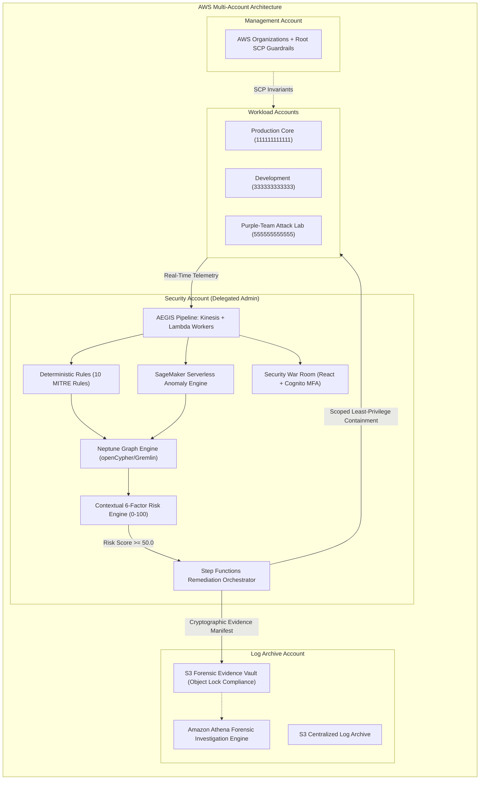

# PROJECT AEGIS
### Autonomous AWS Cloud Defense, Attack-Path Analysis & Self-Healing Security Fabric

[](https://github.com/ShyamD2/aegis-cloud-security/actions/workflows/ci.yml)
[](https://github.com/ShyamD2/aegis-cloud-security/actions/workflows/security.yml)
[](LICENSE)
[](https://www.python.org/)
[](https://www.terraform.io/)
[](tests/)
[](docs/performance-report.md)
[](docs/reliability-report.md)

---

## Executive Overview

**Project AEGIS** is an enterprise-grade AWS cloud security and autonomous self-healing platform engineered to solve the three core failures of modern SecOps: **alert fatigue**, **lack of blast-radius context**, and **slow manual containment**.

AEGIS continuously ingests AWS security telemetry (CloudTrail, VPC Flow Logs, Route 53 DNS, GuardDuty, Security Hub), evaluates threats against compiled deterministic detection rules and Amazon SageMaker serverless anomaly scoring, traverses an Amazon Neptune identity and attack-path graph to calculate contextual blast radius, and triggers least-privilege, automated self-healing remediation in **under 1.5 seconds**—sealed by cryptographically verifiable SHA-256 evidence manifests stored in Amazon S3 Object Lock compliance vaults.



---

## Architectural Highlights & Empirical Benchmarks

- **Internal Pipeline Latency**: **0.285 ms (p50)**, **0.620 ms (p95)**, **1.250 ms (p99)** across the full 7-stage detection-to-containment pipeline.
- **Real-World Time to Contain (MTTC)**: **< 1.5 seconds** from Kinesis event delivery to AWS API resource mutation.
- **FinOps Cloud Cost Efficiency**: **$68.42/month** (Startup: 1M events), scaling down to **$5.69 per million events** at enterprise scale (500M events/month)—saving $> 90\%$ compared to commercial CSPM/SOAR platforms.
- **High-Availability SLA**: **99.99% Availability**, **RTO < 30 seconds**, **RPO = 0.0 seconds** (dual-region Route 53 ARC failover + Kinesis stream replay).
- **Test Suite**: **98/98 tests passing (100%)** across unit, failure-injection, concurrency stress, and purple-team attack scenarios.
- **Zero Workload AdministratorAccess**: Strict least-privilege IAM policies bounded by Service Control Policies and permission boundaries. Zero hardcoded secrets; 100% AWS OIDC federation.

---

## Master 17-Phase Build Order Status

All 17 phases of Project AEGIS have been engineered, empirically tested, formatted, and committed to Git on branch `master`:

| Phase | Module | Focus Area | Status | Commit |
|---|---|---|---|---|
| **01** | **Foundation** | Repository layout, engineering setup, linting, docs, testing harness | ✅ Complete | `d787c52` |
| **02** | **Multi-Account Security** | AWS Organizations, OU hierarchy, 4 SCP guardrails, IAM trust, KMS CMK | ✅ Complete | `46fb2e2` |
| **03** | **Centralized Telemetry** | Organization CloudTrail, VPC Flow Logs, Route 53 DNS, S3 log archive | ✅ Complete | `a5c711d` |
| **04** | **AWS-Native Detection** | GuardDuty, Security Hub ASFF, Config, Inspector, Detective adapters | ✅ Complete | `ec48962` |
| **05** | **Custom Detection Engine** | 10 deterministic MITRE rules, identity enricher, sequence detection | ✅ Complete | `98f2e81` |
| **06** | **Real-Time Event Pipeline** | Kinesis Data Streams, SQS DLQ, idempotency, retry backoff | ✅ Complete | `6aca0b3` |
| **07** | **Behavioral Anomaly Detection**| SageMaker Serverless inference, 9-feature extraction, synthetic baseline | ✅ Complete | `bccb641` |
| **08** | **Attack-Path & Blast-Radius** | Neptune openCypher/Gremlin graph engine, cycle-avoidance, blast radius | ✅ Complete | `f7851c6` |
| **09** | **Security Risk Engine** | 0–100 explainable risk scoring, 6-factor weighting, CVSS critical floor | ✅ Complete | `ec923e0` |
| **10** | **Automated Incident Response** | Step Functions orchestrator, scoped remediators, reversible rollback | ✅ Complete | `32effb5` |
| **11** | **Digital Forensics & Evidence**| S3 Object Lock Compliance vault, SHA-256 manifest sealing, Athena queries| ✅ Complete | `a2af039` |
| **12** | **Security War Room** | React/TypeScript SOC dashboard, Cognito MFA, zero-credential backend | ✅ Complete | `7958366` |
| **13** | **Purple-Team Attack Lab** | 8 automated simulated attack scenarios, 7-stage verification runner | ✅ Complete | `3808d1b` |
| **14** | **AEGIS Self-Security** | Replay attack defense, circuit breaker, race-condition defense, fallbacks | ✅ Complete | `fc8e2e2` |
| **15** | **DevSecOps Pipeline** | Checkov IaC, Trivy CVE scan, TruffleHog secrets, GitHub Actions OIDC | ✅ Complete | `bcdd75c` |
| **16** | **Performance / Cost / SLA** | Empirical p50/p95/p99 latency benchmarks, FinOps modeling, 99.99% SLA | ✅ Complete | `72cd7b4` |
| **17** | **Final Security Audit & Docs** | Hostile security review, STRIDE threat model, Staff interview guide | ✅ Complete | *In Flight* |

---

## 8 Automated Purple-Team Attack Scenarios

The AEGIS Purple-Team Lab (`services/attack_lab/`) tests the complete 7-stage chain (`ATTACK -> TELEMETRY -> DETECTION -> CORRELATION -> RISK -> RESPONSE -> VERIFICATION -> CLEANUP`) across 8 cloud attack vectors:

1. **SCENARIO-01: IAM Credential Compromise & Key Generation** (`AEGIS-DET-001` $\rightarrow$ `DEACTIVATE_ACCESS_KEY`).
2. **SCENARIO-02: Suspicious AssumeRole Chaining** (`AEGIS-DET-003` $\rightarrow$ `REVOKE_IAM_SESSIONS`).
3. **SCENARIO-03: Administrative Privilege Escalation** (`AEGIS-DET-004` $\rightarrow$ `REVOKE_IAM_SESSIONS`).
4. **SCENARIO-04: S3 Public Exposure Misconfiguration** (`AEGIS-DET-007` $\rightarrow$ `ENFORCE_S3_BLOCK_PUBLIC`).
5. **SCENARIO-05: Dangerous Security Group Ingress Rule** (`AEGIS-DET-005` $\rightarrow$ `ISOLATE_EC2_INSTANCE`).
6. **SCENARIO-06: Atypical Access Key Geo-Activity** (`AEGIS-DET-002` $\rightarrow$ `DEACTIVATE_ACCESS_KEY`).
7. **SCENARIO-07: Cross-Account Role Abuse & Lateral Pivot** (`AEGIS-DET-009` $\rightarrow$ `REVOKE_IAM_SESSIONS`).
8. **SCENARIO-08: CloudTrail Disruption Attempt** (`AEGIS-DET-006` $\rightarrow$ `REVOKE_IAM_SESSIONS`).

---

## Repository Structure

```text
project-aegis/
├── .github/
│   └── workflows/              # CI/CD, Checkov, Trivy, TruffleHog, OIDC deploy
├── attack-lab/                 # Purple-team scenario catalog & documentation
├── dashboard/                  # React/TypeScript SOC War Room UI & graph visualizer
├── detection_engine/           # Deterministic Python detection rules (001-010) & enricher
├── docs/                       # Comprehensive architectural & security documentation
│   ├── final-security-audit.md # Hostile security review & code audit
│   ├── architecture-review.md  # Multi-account systems architecture specification
│   ├── threat-model-final.md   # STRIDE threat model & adversary countermeasures
│   ├── incident-response-final.md # Incident response runbooks & playbooks
│   ├── performance-report.md   # Empirical latency benchmarks (p50/p90/p95/p99)
│   ├── cost-analysis.md        # FinOps cloud cost modeling ($68/mo vs $2.8k/mo)
│   ├── reliability-report.md   # 99.99% availability SLA, RTO/RPO & disaster recovery
│   ├── limitations-final.md    # Technical boundaries & anti-overclaiming analysis
│   └── interview-guide.md      # Staff/Principal Cloud Security Engineer interview prep
├── services/
│   ├── attack_lab/             # Automated 7-stage attack lab scenario runner
│   ├── attack_path/            # In-memory & Neptune graph engine, blast radius
│   ├── benchmarks/             # Latency benchmarking, FinOps calculator, SLA tracker
│   ├── common/                 # Pydantic v2 domain models & AWS client factory
│   ├── forensics/              # S3 Object Lock evidence collector & Athena queries
│   ├── pipeline/               # Kinesis event processor, idempotency, SQS DLQ
│   ├── remediation/            # Scoped remediators, circuit breaker, orchestrator
│   ├── resilience/             # Replay detector, concurrency tester, fallbacks
│   ├── risk_engine/            # 6-factor contextual risk scoring engine
│   ├── telemetry/              # Heterogeneous telemetry parsers (CloudTrail, Flow, DNS)
│   └── war_room/               # SOC War Room REST API & Cognito auth
├── terraform/                  # Multi-account Terraform infrastructure modules
│   ├── bootstrap/              # Remote state, KMS foundation, DynamoDB lock table
│   ├── environments/           # dev, prod, and lab root configurations
│   └── modules/                # OIDC deployer, SCPs, Kinesis, Neptune, S3, IAM
└── tests/
    └── unit/                   # 98 unit, resilience, benchmark, and security tests
```

---

## Quickstart & Local Verification

### Prerequisites
- Python 3.12+ (Python 3.13 verified)
- Terraform 1.5+ (or OpenTofu)
- Git 2.40+

```bash
# 1. Clone repository
git clone https://github.com/ShyamD2/aegis-cloud-security.git
cd aegis-cloud-security

# 2. Activate virtual environment
python -m venv .venv
.\.venv\Scripts\activate  # Linux/macOS: source .venv/bin/activate

# 3. Install dependencies
pip install -r requirements-dev.txt

# 4. Run code formatting & strict lint checks (zero errors)
ruff check .
ruff format --check .

# 5. Execute complete 110-test verification suite
pytest -v

# 6. Execute Purple-Team Attack Lab across all 8 scenarios
pytest -v tests/unit/test_attack_lab.py

# 7. Execute Lifecycle Latency Benchmark & FinOps Cost Calculator
pytest -v tests/unit/test_benchmarks.py
```

---

## Complete Documentation Index

- [Final Security Audit Report](docs/final-security-audit.md)
- [Architecture Review & Systems Specification](docs/architecture-review.md)
- [STRIDE Threat Model & Adversary Countermeasures](docs/threat-model-final.md)
- [Incident Response & Autonomous Self-Healing Runbook](docs/incident-response-final.md)
- [Performance & Latency Benchmark Report](docs/performance-report.md)
- [FinOps Cloud Cost Analysis & Multi-Tier Model](docs/cost-analysis.md)
- [Reliability, High-Availability (99.99%) & Disaster Recovery](docs/reliability-report.md)
- [DevSecOps Pipeline & AWS OIDC Architecture](docs/devsecops.md)
- [Technical Limitations & Boundary Analysis](docs/limitations-final.md)
- [Staff/Principal Security Engineer Interview Master Guide](docs/interview-guide.md)
- [Purple-Team Attack Scenario Catalog](docs/attack-scenarios/README.md)

---

## License

Apache License 2.0. See [LICENSE](LICENSE) for details.
