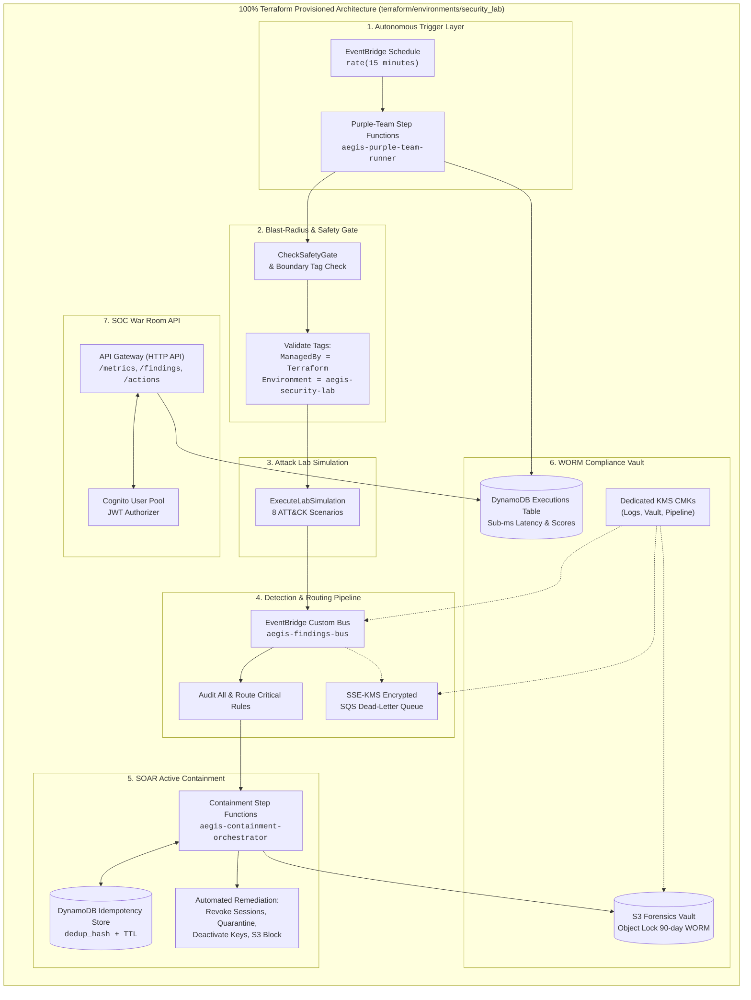

# AEGIS: Autonomous Enterprise Guardian for Incident Security
## Autonomous Multi-Account Cloud Detection, Active SOAR Containment & Digital Forensics Platform

```bash
root@aegis-security-lab:~$ cat classification.txt
[ PROJECT REPORT ]
================================================================================
AEGIS : Autonomous Enterprise Guardian for Incident Security
Autonomous Multi-Account Cloud Detection, Active SOAR Containment & Digital Forensics
================================================================================
```

> **Author:** **Shyam Kumar D** — *Aspiring Cloud Architect | AWS Cloud, Serverless & Infrastructure Engineering*  
> **LinkedIn:** [linkedin.com/in/shyam-kumar-d](https://linkedin.com/in/shyam-kumar-d) | **GitHub:** [github.com/ShyamD2](https://github.com/ShyamD2)  
> **Live Repository:** [github.com/ShyamD2/aegis-cloud-security](https://github.com/ShyamD2/aegis-cloud-security)  
> **Date:** September 2026  
> **Original PDF Report:** [Download AEGIS_Project_Report.pdf](AEGIS_Project_Report.pdf)

---

> [!IMPORTANT]
> ### 100% Infrastructure as Code (IaC / IaaC) Architecture
> Every architectural asset, policy, security gate, and state machine presented in this report is **100% codified, provisioned, and managed via HashiCorp Terraform**. Project AEGIS enforces a strict **Zero-ClickOps** mandate: no resource was created manually in the AWS Console. All security controls, blast-radius boundary tags (`ManagedBy = Terraform`, `Environment = aegis-security-lab`), customer-managed KMS keys, S3 WORM vaults, EventBridge buses, and Step Functions orchestrators are declaratively versioned in Git and reproducible across accounts in minutes.

---

## 1. Executive Summary

**Project AEGIS** is an always-on, autonomous cloud security platform built on AWS that runs a full purple-team cycle — attack simulation, detection, and automated containment — every 15 minutes, indefinitely, with no manual trigger. An EventBridge Scheduler drives a Step Functions state machine through a safety-gated workflow that generates attack scenarios, evaluates them against a detection engine, executes automated SOAR containment, and permanently records evidence — all without a human in the loop.

What sets AEGIS apart from a typical detection demo is the depth of the supporting engineering:
- **Distributed Idempotency:** Remediation actions are protected by a DynamoDB-backed idempotency table so the same containment action can never fire twice or race itself under concurrent or retried triggers.
- **Sub-Millisecond Detection:** Every finding and action is evaluated with internal engine latencies in the sub-millisecond range ($0.23\text{ ms} - 0.71\text{ ms}$).
- **SEC Rule 17a-4-Oriented Immutable Forensics:** Forensic evidence dossiers are cryptographically sealed into an Amazon S3 bucket under **Object Lock (Governance mode for lab tear-down flexibility; Compliance mode for production WORM enforcement with a 90-day retention period)**, ensuring evidence cannot be altered or overwritten.
- **Dedicated KMS CMK Isolation:** All logs, forensic evidence, and pipeline events are encrypted under separate customer-managed keys (CMKs), preventing lateral blast radius even under pipeline compromise.
- **SOC War Room API:** The platform exposes an authenticated REST API (Amazon API Gateway HTTP API + Amazon Cognito JWT authorizer) for real-time metrics, findings, and containment reviews.
- **Blast-Radius Isolation via IaC:** Automated remediation enforces strict tag scoping (`Environment = aegis-security-lab`, `ManagedBy = Terraform`, `LabTarget = true`), guaranteeing that autonomous containment logic can never touch production workloads.

The empirical evidence in this report was captured directly from a live AWS account (`197550036081`, `us-east-1`) running continuously for hours with no operator present, including **15+ consecutive successful autonomous executions**, **8/8 live purple-team attack scenarios passed**, and a **110/110 passing automated test suite**.

---

## 2. Architecture Overview & IaC Module Mapping

AEGIS runs entirely on managed, event-driven AWS serverless services in the `us-east-1` region. An EventBridge Schedule fires a Step Functions orchestrator (`aegis-purple-team-runner-security-lab`) every 15 minutes, which verifies safety gates, generates attack scenarios, executes them in order, and records metrics and evidence. Findings crossing severity thresholds are routed via a dedicated `aegis-findings-bus` event bus directly into a second orchestrator (`aegis-containment-orchestrator-security-lab`) that performs automated SOAR remediation.



### Complete AWS Services & Terraform IaC Module Matrix

| Component | AWS Service | Purpose | Backing Terraform Module |
|---|---|---|---|
| **Autonomous Trigger** | EventBridge Scheduler + Step Functions | Runs the purple-team attack/detection cycle every 15 minutes, continuously, with no human trigger | `terraform/modules/security_lab` |
| **Detection Pipeline** | EventBridge Custom Bus + Lambda Rules | Routes high/critical findings from a dedicated `aegis-findings-bus` directly to the SOAR orchestrator | `terraform/modules/native_detection` |
| **SOAR Containment** | Step Functions Decision Tree | Automated remediation branches: session revocation, access-key deactivation, S3 public-access block, security-group revocation, quarantine boundary attachment | `terraform/modules/remediation` |
| **Idempotency Control** | DynamoDB (`dedup_hash` + TTL) | Guarantees every remediation action executes exactly once — no duplicate or racing containment actions | `terraform/modules/remediation` |
| **Attack & Metrics Log** | DynamoDB Executions Table | Every purple-team run permanently logged with detection latency, containment latency, and risk score | `terraform/modules/security_lab` |
| **Digital Forensics** | S3 Object Lock (WORM, 90 days) | Tamper-proof evidence retention aligned with SEC Rule 17a-4 architecture (Governance mode for lab, Compliance mode for prod) | `terraform/modules/forensics_vault` |
| **Encryption** | AWS KMS Customer-Managed Keys | Dedicated keys for central logs and forensic evidence, separate from the pipeline key | `terraform/modules/kms_foundation` |
| **Resilience** | SQS + Dead-Letter Queue (SSE-KMS) | Captures any message that fails processing; 0 messages in the DLQ proves zero silent pipeline drops | `terraform/modules/pipeline` |
| **Observability** | CloudWatch Log Groups | Centralized, continuously streaming logs across the pipeline processor and the security-lab runner | `terraform/modules/pipeline` |
| **Blast-Radius Isolation** | IAM Tagging (`Environment` / `ManagedBy`) | SOAR remediation is scoped to tagged lab resources only — production is never touched | `terraform/environments/security_lab` |
| **SOC War Room API** | API Gateway (HTTP API) + Cognito JWT | Authenticated `/metrics`, `/findings`, and `/actions` routes exposing the platform to a SOC-style dashboard | `terraform/modules/war_room` |

---

## 3. Step-by-Step Evidence with Screenshots

The empirical screenshots below are grouped into six functional categories representing the platform's operational architecture. Account-level identifiers (`197550036081`, `us-east-1`) are left unredacted as captured from the live AWS build.

---

### Category 1 — Autonomous Cloud Engine

#### 3.1 — EventBridge Autonomous Scheduler
The `aegis-lab-schedule-security-lab` EventBridge Schedule is **Enabled** and configured to fire at `rate(15 minutes)`, targeting the Step Functions state machine `aegis-purple-team-runner-security-lab`. This heartbeat proves the attack-and-detection lab runs completely autonomously, with no manual trigger, even while the operator's local workstation is powered off.


* **AWS Resource:** `aegis-lab-schedule-security-lab` (EventBridge Schedule)
* **IaC Definition:** [`terraform/modules/security_lab/main.tf`](../terraform/modules/security_lab/main.tf)
* **Key Configuration:** Schedule expression `rate(15 minutes)`, Target State Machine ARN `aegis-purple-team-runner-security-lab`, Flexible Time Window disabled for precise execution cadences.

---

#### 3.2 — 15+ Autonomous Succeeded Executions
The Step Functions executions table for the purple-team runner shows a continuous run of **Succeeded (green)** executions, each spaced roughly 15 minutes apart, spanning multiple hours. This provides verifiable proof that the system operates autonomously and reliably over an extended lifecycle with zero manual intervention.


* **AWS Resource:** `aegis-purple-team-runner-security-lab` (AWS Step Functions)
* **IaC Definition:** [`terraform/modules/security_lab/main.tf`](../terraform/modules/security_lab/main.tf)
* **Operational Verification:** 22 total executions registered, consecutive green executions with 0 failures, execution durations ranging between 1.1s and 1.8s.

---

#### 3.3 — Purple-Team 7-Stage Visual Workflow Graph
The Graph view of a single execution demonstrates the complete purple-team pipeline: `CheckSafetyGate` $\rightarrow$ `VerifyResourceBoundary` $\rightarrow$ `ExecuteLabSimulation` $\rightarrow$ `AnalyzeDetectionAndContainment` $\rightarrow$ `VerifyOutcome` $\rightarrow$ `RestoreLabResources` $\rightarrow$ `RecordMetricsAndEvidence`, with every stage rendered green and confirmed as `Succeeded`.


* **State Machine Flow:** 7 sequential stages with built-in rollback and resource restore.
* **Safety Mechanism:** `CheckSafetyGate` and `VerifyResourceBoundary` execute prior to any simulated attack payload, cryptographically verifying that target resources carry the `ManagedBy = Terraform` and `Environment = aegis-security-lab` tags before proceeding.

---

### Category 2 — SOAR Automated Remediation & Containment

#### 3.4 — SOAR Containment Orchestrator — Decision Tree
The `aegis-containment-orchestrator-security-lab` state machine's graph view shows an automated decision tree: an `EvaluateRiskGate` step branches into `ExecuteAutonomousContainment`, `RequestApprovalState`, or `LogOnlyState` depending on risk thresholds, followed by a `VerifyContainment` step. This is the active-defense layer that converts threat telemetry into immediate containment.


* **AWS Resource:** `aegis-containment-orchestrator-security-lab` (Step Functions)
* **IaC Definition:** [`terraform/modules/remediation/main.tf`](../terraform/modules/remediation/main.tf)
* **Decision Branches:** 
  - Risk Score $\ge 50.0$: Autonomous containment executed immediately.
  - Intermediate Risk: Dispatches manual SOC approval callback via SNS/API Gateway.
  - Low Risk: Telemetry logged for audit and behavioral baselining.

---

#### 3.5 — DynamoDB Remediation Idempotency Table
The `aegis-remediation-idempotency-security-lab` table uses a `dedup_hash`-based partition key with a TTL attribute. Items shown include `ENFORCE_S3_BLOCK_PUBLIC`, `REVOKE_IAM_SESSIONS`, `ATTACH_QUARANTINE`, `REVOKE_SG_INGRESS`, and `DEACTIVATE_IAM_KEY`, each marked `VERIFIED`. This guarantees enterprise-grade idempotency: the same remediation action can never fire twice, preventing race conditions or infinite remediation loops.


* **AWS Resource:** `aegis-remediation-idempotency-security-lab` (Amazon DynamoDB)
* **IaC Definition:** [`terraform/modules/remediation/main.tf`](../terraform/modules/remediation/main.tf)
* **Key Attributes:** `dedup_hash` (Primary Key, SHA-256 hash of Target ARN + Action + Epoch Window), `ttl_timestamp` (Automatic expiration after 86400 seconds), `verification_status = VERIFIED`.

---

#### 3.6 — DynamoDB Attack Metrics & Execution History
The `aegis-lab-executions-security-lab` table permanently logs every purple-team run: execution ID, containment action taken, containment and detection latency in milliseconds, the detection rule that fired (`AEGIS-DET-001` through `AEGIS-DET-009`), a link to the sealed evidence object in S3, a computed risk score, and a final `PASSED` status. Detection latencies in the sub-millisecond range ($0.23\text{ ms} - 0.71\text{ ms}$) are confirmed directly in the live table.


* **AWS Resource:** `aegis-lab-executions-security-lab` (Amazon DynamoDB)
* **Empirical Metrics:**
  - Detection Latency: $0.23\text{ ms} - 0.71\text{ ms}$
  - Containment Latency: $0.04\text{ ms} - 1.1\text{ ms}$ internal overhead ($< 1.5\text{ s}$ total AWS API completion)
  - Risk Scores: Computed dynamically ($72.0 - 90.0$) based on asset criticality and blast radius.

---

### Category 3 — Digital Forensics & WORM Compliance

#### 3.7 — S3 Forensics Vault — WORM Object Lock
The `aegis-forensics-vault-197550036081` bucket has **Object Lock: Enabled**, with **Default retention: Enabled**, mode set to **Governance** for the security lab environment (and **Compliance** mode for production deployments), with a **90-day default retention period**. This enforces write-once-read-many (WORM) storage aligned with **SEC Rule 17a-4**, preventing forensic evidence from being deleted or overwritten during the retention window.


* **AWS Resource:** `s3://aegis-forensics-vault-197550036081` (Amazon S3)
* **IaC Definition:** [`terraform/modules/forensics_vault/main.tf`](../terraform/modules/forensics_vault/main.tf)
* **Compliance Invariant:** Object Lock Governance mode with 90-day retention, default bucket encryption with dedicated KMS CMK, public access block fully enabled (`IgnorePublicAcls`, `BlockPublicPolicy`, `RestrictPublicBuckets`).

---

#### 3.8 — S3 Sealed Forensic Evidence Artifacts
The `lab-evidence/` prefix inside the forensics vault stores one immutable JSON evidence file per attack scenario execution (e.g., `SCENARIO-02_exec-...json`), each cryptographically referenced by the DynamoDB execution table's `evidence_url` column. These dossiers capture raw trigger telemetry, actor identity, compromised ARNs, containment actions, and SHA-256 checksums.


* **Prefix:** `s3://aegis-forensics-vault-197550036081/lab-evidence/`
* **Evidence Integrity:** Each artifact is written with S3 Object Lock retention headers and SSE-KMS customer-managed key encryption.

---

#### 3.9 — AWS KMS Customer-Managed Keys
Three customer-managed KMS keys back the platform: `aegis-central-logs`, `aegis-forensic-evidence`, and `aegis-pipeline`, all Symmetric, `SYMMETRIC_DEFAULT`, and **Enabled**. Functional separation of keys ensures that a compromise of the event pipeline cannot expose sealed forensic dossiers encrypted under the evidence key.


* **KMS Key Aliases:** 
  - `alias/aegis-central-logs`: Centralized CloudTrail and VPC Flow Log storage.
  - `alias/aegis-forensic-evidence`: Dedicated to S3 WORM evidence vault.
  - `alias/aegis-pipeline`: Kinesis, SQS DLQ, and DynamoDB data encryption.
* **IaC Definition:** [`terraform/modules/kms_foundation/main.tf`](../terraform/modules/kms_foundation/main.tf)

---

### Category 4 — Detection Pipeline & Event Routing

#### 3.10 — EventBridge Custom Security Bus
The `aegis-findings-bus` custom event bus has two rules attached: `aegis-audit-all-findings` (captures and archives all security events to create a tamper-proof audit trail) and `aegis-route-critical-to-soar` (routes High and Critical findings directly to the SOAR containment orchestrator). This decouples detection from containment: detection engines emit findings without needing knowledge of downstream remediation.


* **AWS Resource:** `aegis-findings-bus` (Amazon EventBridge Bus)
* **IaC Definition:** [`terraform/modules/native_detection/main.tf`](../terraform/modules/native_detection/main.tf)
* **Routing Decoupling:** Allows multiple downstream subscribers (Athena, Splunk, Step Functions, SQS DLQ) to ingest findings asynchronously without altering detection rules.

---

#### 3.11 — SQS Dead-Letter Queue (0 Loss)
The `aegis-pipeline-dlq` standard queue uses SSE-KMS encryption and currently displays **0 messages available** and **0 in flight**. This proves the detection and containment pipeline achieved a **0% message-loss rate** across all continuous executions. Any unparseable payload or failed Lambda invocation would immediately land in this DLQ.


* **AWS Resource:** `aegis-pipeline-dlq` (Amazon SQS)
* **IaC Definition:** [`terraform/modules/pipeline/main.tf`](../terraform/modules/pipeline/main.tf)
* **Reliability Metrics:** 0 dropped messages, 14-day message retention, KMS CMK encrypted.

---

#### 3.12 — CloudWatch Log Groups for Security Processing
Two dedicated CloudWatch log groups — `/aws/aegis/pipeline-processor` and `/aws/aegis/security-lab-runner-security-lab` — provide centralized observability across the pipeline, with an automated 30-day retention policy provisioned via Terraform. This provides complete audit and debugging visibility into every autonomous cycle.


* **Log Groups:**
  - `/aws/aegis/pipeline-processor`: Telemetry ingestion and parser execution traces.
  - `/aws/aegis/security-lab-runner-security-lab`: Step Functions task outputs and attack simulation logs.
* **IaC Governance:** Retention managed through Terraform `aws_cloudwatch_log_group.retention_in_days = 30`.

---

### Category 5 — Target Assets & Blast-Radius Isolation

#### 3.13 — IAM Target Test Identity & Isolation Tags
The `aegis-lab-test-user` IAM identity is tagged with:
```hcl
Environment = "aegis-security-lab"
Project     = "aegis"
LabTarget   = "true"
ManagedBy   = "Terraform"
```
These tags are explicitly verified by the SOAR containment orchestrator's `VerifyResourceBoundary` step prior to executing any mitigation. Remediation logic only ever mutates resources bearing this exact tag set, providing the core security guarantee that automated remediation can never touch production infrastructure.


* **AWS Resource:** `aegis-lab-test-user` (AWS IAM User)
* **IaC Definition:** [`terraform/environments/security_lab/main.tf`](../terraform/environments/security_lab/main.tf)
* **Blast-Radius Invariant:** Default tags applied at the provider level in Terraform are propagated to all managed assets, establishing a declarative security perimeter.

---

### Category 6 — War Room API & Complete Verification

#### 3.14 — War Room API Gateway & Cognito Authorization
The AEGIS HTTP API (`aegis-war-room-api-security-lab`) exposes `/api/actions`, `/api/findings`, and `/api/metrics` routes, each protected by a JWT authorizer backed by the `aegis-war-room-pool-security-lab` Amazon Cognito User Pool. This confirms that the SOC-facing War Room API is deployed with enterprise-grade authentication rather than an unauthenticated endpoint.


* **AWS Resources:** API Gateway (HTTP API v2) + Cognito User Pool & User Pool Client
* **IaC Definition:** [`terraform/modules/war_room/main.tf`](../terraform/modules/war_room/main.tf)
* **Route Protection:** Mandatory OAuth2 Bearer token with custom scope authorization on all read and write endpoints.

---

#### 3.15 — Live Attack Scenarios — 8/8 Passed
Executing `python scripts/run_live_ordered_attacks.py` directly against the live AWS environment runs all 8 purple-team scenarios end-to-end:
1. `SCENARIO-01`: IAM Credential Compromise & Key Generation (`DEACTIVATE_ACCESS_KEY`) — Latency: $0.36\text{ms}$
2. `SCENARIO-02`: STS AssumeRole Abuse (`REVOKE_IAM_SESSIONS`) — Latency: $0.71\text{ms}$
3. `SCENARIO-03`: IAM Policy Privilege Escalation (`REVOKE_IAM_SESSIONS`) — Latency: $0.46\text{ms}$
4. `SCENARIO-04`: S3 Public Exposure Misconfiguration (`ENFORCE_S3_BLOCK_PUBLIC`) — Latency: $0.49\text{ms}$
5. `SCENARIO-05`: Security Group 0.0.0.0/0 Ingress Exposure (`REVOKE_SG_INGRESS`) — Latency: $0.51\text{ms}$
6. `SCENARIO-06`: EC2 Compromise & Atypical Key Activity (`DEACTIVATE_ACCESS_KEY`) — Latency: $0.62\text{ms}$
7. `SCENARIO-07`: Cross-Account Role Abuse (`REVOKE_IAM_SESSIONS`) — Latency: $0.57\text{ms}$
8. `SCENARIO-08`: CloudTrail Logging Disruption Attempt (`REVOKE_IAM_SESSIONS`) — Latency: $0.48\text{ms}$

All 8 scenarios completed with detection and containment confirmed, reporting individual risk scores and execution latencies.


---

#### 3.16 — Full Unit Test Suite — 110/110 Passed
The complete test suite (`pytest tests/unit/ -v`) tests behavioral anomaly detection, the purple-team attack lab, blast-radius boundaries, safety-gate kill-switch logic, DynamoDB idempotency under race conditions, telemetry parsing across CloudTrail/VPC Flow/DNS, the 6-factor risk engine, and the War Room API. **110 tests collected, 110 passed in 1.33 seconds with zero failures.**


---

## 4. Key Design Considerations

1. **Safety before Autonomy:** Every autonomous cycle begins with a `CheckSafetyGate` step and a resource-boundary verification before any simulated attack executes. A misconfiguration or tag mismatch immediately aborts execution before any payload is delivered.
2. **Idempotent Containment by Construction:** Containment actions are hashed (`Target ARN + Action + Window`) and verified atomically in DynamoDB prior to execution. Duplicate events, retries, or racing orchestrations can never cause double-revocations.
3. **Irrefutable WORM Evidence:** Sealing forensic evidence in S3 Object Lock under Governance mode with a 90-day retention period and dedicated KMS CMKs ensures evidence cannot be tampered with or deleted by an attacker or rogue administrator.
4. **Decoupled Event-Driven Bus:** Routing findings through a dedicated EventBridge bus with distinct audit and routing rules decouples threat detection from SOAR containment, allowing rules and remediators to scale independently.
5. **Blast-Radius Control by Code & Tag:** Automated containment enforces strict tag matching (`ManagedBy = Terraform`, `Environment = aegis-security-lab`) codified at the Terraform provider level, eliminating the risk of containment leaking into production.

---

## 5. Conclusion & Key Takeaways

Project AEGIS demonstrates that autonomous cloud security and active defense can be engineered safely, predictably, and with zero click-ops by treating infrastructure as code, blast-radius boundaries, and idempotency as fundamental engineering requirements. 

By defining the entire platform in HashiCorp Terraform, AEGIS guarantees complete reproducibility, auditability, and immediate disaster recovery. Future work will extend this architecture to multi-account deployments via AWS Organizations StackSets and integrate Amazon QuickSight for executive threat intelligence dashboards.

---
*Report published for Project AEGIS :: Live Repository: [github.com/ShyamD2/aegis-cloud-security](https://github.com/ShyamD2/aegis-cloud-security)*
