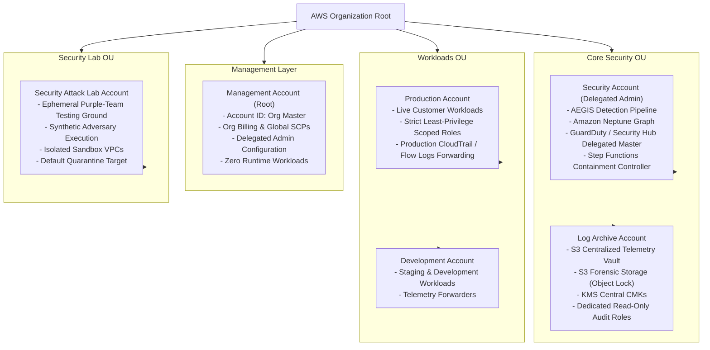

# AEGIS Multi-Account Architecture
## AWS Organizations, Organizational Units (OUs) & Delegated Administration

### 1. Multi-Account Structure Overview

In modern cloud security, an AWS Account is the primary security boundary. Placing security services, logging pipelines, production workloads, and testing environments into separate accounts prevents lateral movement and blast-radius contamination.

AEGIS utilizes a 6-account AWS Organization structure structured across three dedicated Organizational Units (OUs):

---

### 2. Account Roles & Responsibilities

| Account | Operational Purpose | Security Tier | IAM Access Strategy |
|---|---|---|---|
| **Management** | Organizational billing, account creation, SCP attachment. | High Risk / Break-Glass | Hardware MFA only; no CI/CD deployments; zero workload resources. |
| **Security** | Houses the AEGIS processing fabric, detection engine, Neptune graph, and Step Functions. | Control Plane | Delegated administrator for GuardDuty, Security Hub, Detective, and Inspector. |
| **Log Archive** | Central immutable repository for all security telemetry and forensic evidence. | Audit Plane | S3 Object Lock; write access restricted to AWS Service Principals; read access restricted to AEGIS Ingestion. |
| **Production** | Runs production business services and customer-facing infrastructure. | Workload Plane | Scoped `AegisAuditRole` for read telemetry; scoped `AegisContainmentRole` with permission boundary. |
| **Development** | Lower-environment integration and developer testing. | Workload Plane | Scoped `AegisAuditRole` and containment capabilities. |
| **Security Lab** | Isolated environment for executing Phase 13 purple-team attack simulations. | Attack Sandbox | Autonomous remediation allowed; quarantined from corporate networks. |

---

### 3. Delegated Security Administration

AWS Organizations permits designated member accounts to manage security services on behalf of the organization without accessing the Management Account.

AEGIS designates the **Security Account** as the Delegated Administrator for:
- **AWS Security Hub**: Aggregates security findings across all 6 accounts into the Security Account finding bus.
- **Amazon GuardDuty**: Centralized detector management and organization-wide threat detection.
- **Amazon Inspector**: Centralized vulnerability assessments and container/EC2 scanning.
- **Amazon Detective**: Cross-account investigation and graph analysis integration.
- **AWS CloudTrail**: Service-linked organization trail with central delivery to Log Archive account.
