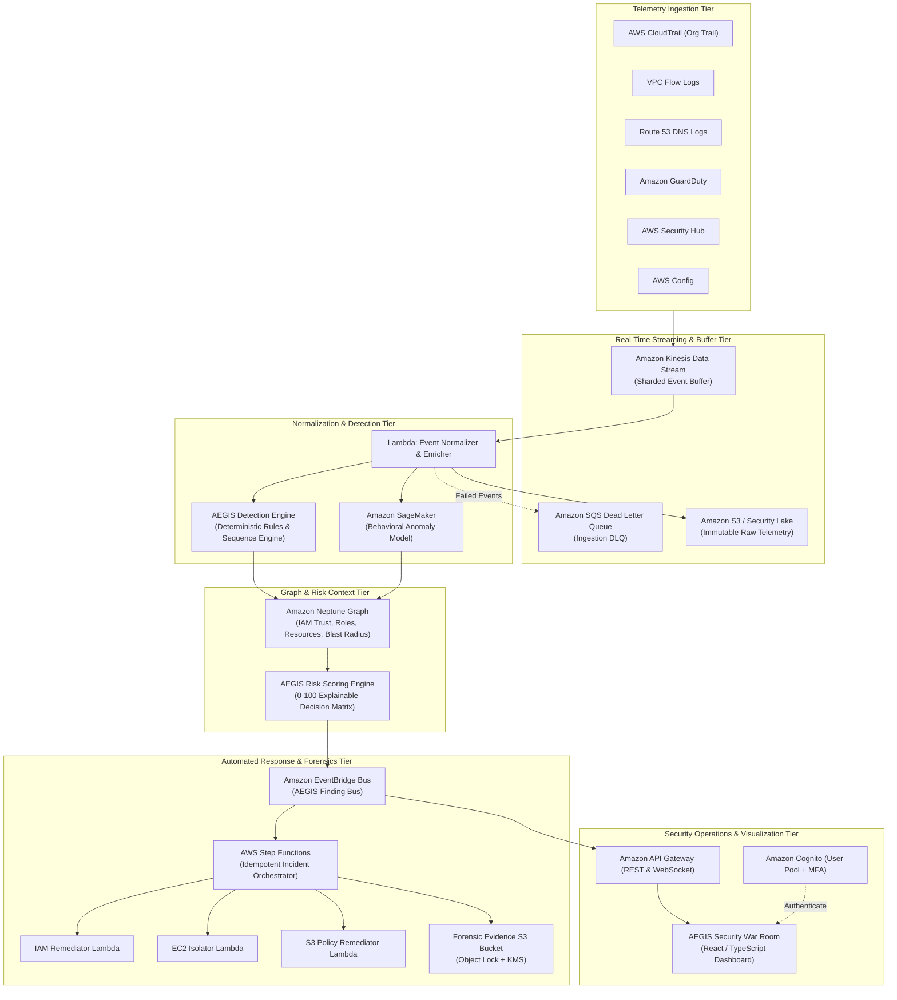

# AEGIS Architecture Guide
## Autonomous AWS Cloud Defense, Attack-Path Analysis & Self-Healing Security Fabric

### 1. High-Level System Architecture

Project AEGIS is designed around a multi-tier, decoupled, event-driven architecture that spans multi-account AWS organizations. Security telemetry is ingested centrally, processed through dual detection engines (deterministic sequence rules and behavioral ML anomaly detection), contextualized with an IAM/resource graph in Amazon Neptune, scored by a deterministic Risk Engine, and remediated via Step Functions state machines.



---

### 2. Multi-Account Trust & Security Boundary Architecture

AEGIS enforces strict segregation between the management plane, the centralized security plane, centralized log archives, and active workload environments.

```mermaid
graph TD
    subgraph Root["AWS Organization Management"]
        MGT["Management Account\n- AWS Organizations\n- Service Control Policies (SCPs)\n- Delegated Admin Setup"]
    end

    subgraph SecurityOU["Security Core OU"]
        SEC["Security Operations Account\n- AEGIS Engine & Processing Pipeline\n- Neptune Graph Database\n- Step Functions Orchestrators\n- Delegated Admin for GuardDuty & Security Hub"]
        LOG["Log Archive Account\n- Centralized S3 Log Vault (Object Lock)\n- KMS Central Log Key\n- Amazon Security Lake"]
    end

    subgraph WorkloadOU["Workloads OU"]
        PROD["Production Account\n- Workload VPCs & Data Stores\n- Read-Only AEGIS Audit Role\n- Remediation Worker Roles (Scoped)"]
        DEV["Development Account\n- Staging Workloads\n- Telemetry Forwarders"]
    end

    subgraph LabOU["Security Lab OU"]
        LAB["Attack Lab Account\n- Isolated VPC\n- Synthetic Attack Simulation Runner\n- Purple Team Testing Environment"]
    end

    MGT -->|Enforce SCP Guardrails| SEC
    MGT -->|Enforce SCP Guardrails| LOG
    MGT -->|Enforce SCP Guardrails| PROD
    MGT -->|Enforce SCP Guardrails| DEV
    MGT -->|Enforce SCP Guardrails| LAB

    PROD -->|Forward CloudTrail & Flow Logs| LOG
    DEV -->|Forward CloudTrail & Flow Logs| LOG
    LAB -->|Forward CloudTrail & Flow Logs| LOG

    LOG -->|Kinesis Streaming Sync| SEC
    SEC -->|Cross-Account AssumeRole (Least Privilege)| PROD
    SEC -->|Cross-Account AssumeRole (Least Privilege)| DEV
    SEC -->|Cross-Account AssumeRole (Least Privilege)| LAB
```

---

### 3. Pipeline Data Flow & Sequence

1. **Telemetry Generation**: An API call occurs in a workload account (e.g. `AttachUserPolicy` or `CreateAccessKey`).
2. **Central Streaming**: CloudTrail logs to the Central S3 bucket in the Log Archive account and publishes an event notification to the AEGIS Kinesis Data Stream in the Security Account.
3. **Normalization**: The Ingestion Lambda consumes Kinesis records, validates schema conformance against `CloudTrailRecord`, extracts the principal, target resource, source IP, user agent, and timestamp, and writes enriched metadata.
4. **Dual Detection**:
   - **Deterministic Rules**: Evaluates high-fidelity signatures (e.g., suspicious sequence: `CreateAccessKey` followed immediately by `PutUserPolicy` and `GetSecretValue`).
   - **Behavioral ML**: Queries SageMaker inference endpoint to detect abnormal API frequency, anomalous source IP geo-distance, or unusual hour-of-day access.
5. **Contextual Graph Analysis**: The Neptune engine models the compromised identity:
   - What roles can this principal assume?
   - What S3 buckets, RDS databases, or Secrets Manager secrets can those roles touch?
   - Does this path bridge from Development into Production?
6. **Risk Calculation**: AEGIS computes a deterministic composite score ($0-100$) based on detection severity, blast radius, anomaly score, and asset criticality.
7. **Orchestrated Remediation**: If Risk $\ge 76$ (CRITICAL), the Step Functions state machine triggers:
   - Acquires DynamoDB distributed idempotency lock.
   - Attaches a denial session policy or detaches active access keys.
   - Isolates affected EC2 instance to a quarantine security group.
   - Verifies effective configuration change via AWS Config / Describe APIs.
   - Emits immutable evidence manifest to the Forensics S3 bucket.
8. **War Room Telemetry**: EventBridge pushes finding updates via WebSocket API to the React War Room dashboard.

---

### 4. Key AWS Services Summary

| AWS Service | Operational Role in AEGIS | Security Controls Applied |
|---|---|---|
| **AWS Organizations** | Account structure, SCP guardrail enforcement | Multi-account isolation, root SCP lock |
| **AWS CloudTrail** | Comprehensive multi-account management & data event auditing | Multi-region, log file validation, KMS CMK |
| **Amazon S3** | Telemetry archive, forensic evidence store | SSE-KMS, Object Lock (Compliance mode), Public Access Block |
| **Amazon Kinesis** | High-throughput real-time security event buffer | Server-side KMS encryption, VPC endpoint |
| **AWS Lambda** | Normalization, detection evaluation, remediator execution | Scoped execution IAM roles, reserved concurrency, dead-letter SQS |
| **AWS Step Functions** | Distributed incident containment state machine | Idempotent execution, retry backoff, catch handlers |
| **Amazon DynamoDB** | Idempotency lock table, finding cache, remediation tracking | Point-in-time recovery, customer-managed KMS |
| **Amazon Neptune** | Graph database for IAM attack paths & blast radius | Multi-AZ, encryption at rest, IAM DB authentication |
| **Amazon SageMaker** | Behavioral anomaly inference endpoint | VPC-only access, encrypted volume, model artifact verification |
| **Amazon EventBridge** | Real-time event bus connecting findings to workflows | Schema validation, dead-letter queues |
| **AWS KMS** | Envelope encryption across all data at rest | Separate CMKs for logging, forensics, and state |
