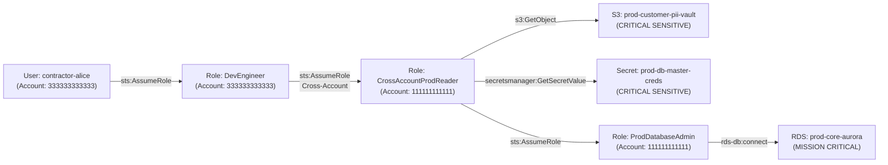

# Attack-Path Analysis & Graph Modeling
## Project AEGIS - Phase 08 Architecture & Technical Specification

```
                     ┌─────────────────────────────┐
                     │ Amazon CloudTrail / Config  │
                     └──────────────┬──────────────┘
                                    │ AWS Resource & IAM Discovery
                                    ▼
                     ┌─────────────────────────────┐
                     │   AEGIS Graph Compiler      │
                     │  (IAM & Trust Evaluator)    │
                     └──────────────┬──────────────┘
                                    │ openCypher DDL / REST API
                                    ▼
       ┌─────────────────────────────────────────────────────────────┐
       │                Amazon Neptune Graph Cluster                 │
       │                                                             │
       │   (User) ──ASSUME_ROLE──► (Role) ──ASSUME_ROLE──► (Role)    │
       │                             │                       │       │
       │                         CAN_ACCESS              CAN_ACCESS  │
       │                             ▼                       ▼       │
       │                         (S3Bucket)             (RDS Cluster)│
       └─────────────────────────────┬───────────────────────────────┘
                                     │
                                     ▼
                     ┌─────────────────────────────┐
                     │  Blast-Radius Calculation   │
                     │   & Attack Path Replay      │
                     └─────────────────────────────┘
```

---

### 1. Architectural Overview & Graph Entities

AEGIS translates complex, multi-account AWS authorization topologies into directed property graphs executed within **Amazon Neptune**.

#### 1.1 Node Labels (`NodeType`)
| Node Type | Description | Key Attributes |
| :--- | :--- | :--- |
| `USER` | IAM User Principal | `id` (ARN), `name`, `account_id`, `criticality` |
| `ROLE` | IAM Role Principal | `id` (ARN), `name`, `account_id`, `criticality` |
| `POLICY` | IAM Managed/Inline Policy | `id` (ARN), `policy_name`, `account_id` |
| `S3_BUCKET` | Amazon S3 Storage Bucket | `id` (ARN), `is_sensitive`, `criticality`, `region` |
| `EC2_INSTANCE` | Amazon EC2 Compute Node | `id` (Instance ID), `account_id`, `region` |
| `RDS_DATABASE` | Relational Database Cluster | `id` (ARN), `is_sensitive`, `criticality`, `engine` |
| `SECRETS_MANAGER_SECRET` | Secrets Manager Secret | `id` (ARN), `is_sensitive`, `criticality` |
| `SECURITY_GROUP` | VPC Network Security Group | `id` (SG ID), `vpc_id`, `account_id` |
| `ACCOUNT` | AWS Organization Account | `id` (12-digit ID), `name`, `criticality` |

#### 1.2 Edge Relationships (`EdgeType`)
- `ASSUME_ROLE`: Evaluates STS `sts:AssumeRole` trust relationships and principal permissions.
- `CAN_ACCESS`: Models data-plane actions (e.g. `s3:GetObject`, `secretsmanager:GetSecretValue`, `rds-db:connect`).
- `IN_ACCOUNT`: Structural link binding an entity to its parent AWS Account.
- `MEMBER_OF_SG`: Compute instance attachment to a Security Group.
- `ALLOWS_TRAFFIC`: Ingress network flow permitted between CIDR blocks or SG pairs.

---

### 2. Multi-Account Traversal & Cycle Detection

#### 2.1 Attack-Path Replay Flow


#### 2.2 Algorithmic Cycle Prevention
In AWS IAM, circular trust relationships can exist (e.g., Role A is permitted to assume Role B, and Role B is permitted to assume Role A). Without explicit cycle tracking:
- Standard breadth-first or depth-first graph traversals would enter infinite recursive loops.
- Blast radius calculations would deadlock or produce infinite path duplicates.

AEGIS implements a strictly visited-path memoization queue during BFS expansion:
```python
# Avoid cycles: do not revisit any node already in current traversal path
if next_id in current_path:
    continue
```
Traversal depth is bounded by `max_depth` (default: 6 hops), capping path discovery at realistic lateral movement chains.

---

### 3. OpenCypher Traversal Queries for Amazon Neptune

AEGIS exports synchronized openCypher statements directly to Neptune cluster endpoints:

#### Ingesting Nodes:
```cypher
MERGE (n:USER {id: 'arn:aws:iam::333333333333:user/contractor-alice'})
SET n.name = 'contractor-alice',
    n.account_id = '333333333333',
    n.is_sensitive = false,
    n.criticality = 2.0;
```

#### Ingesting Edges:
```cypher
MATCH (s {id: 'arn:aws:iam::333333333333:user/contractor-alice'}),
      (t {id: 'arn:aws:iam::333333333333:role/DevEngineer'})
MERGE (s)-[r:ASSUME_ROLE]->(t)
SET r.action = 'sts:AssumeRole';
```

#### Traversing Multi-Hop Attack Paths to Sensitive Resources:
```cypher
MATCH path = (u:USER {id: 'arn:aws:iam::333333333333:user/contractor-alice'})-[*1..5]->(target)
WHERE target.is_sensitive = true
RETURN path, [n IN nodes(path) | n.id] AS hop_sequence, target.criticality
ORDER BY length(path) ASC;
```

---

### 4. Explicit Anti-Overclaiming & IAM Boundaries

> [!IMPORTANT]
> **Amazon Neptune does NOT understand AWS IAM semantics automatically.**
>
> 1. Neptune is a managed graph database that executes openCypher and Apache TinkerPop Gremlin queries. It does not parse JSON IAM policy documents, condition keys (`aws:PrincipalOrgID`, `aws:SourceIp`), SCP evaluation hierarchies, or session policies.
> 2. The **AEGIS Graph Engine** performs the semantic IAM evaluation: it inspects AWS Config, IAM client metadata, and trust policies, resolves condition logic, and inserts the resulting traversable directed edges into Neptune.
> 3. Graph edges reflect *possible* access paths based on static policy analysis. Real-world network boundaries (VPC endpoints, private subnets, NACLs) and temporary credential expirations act as external constraints.
