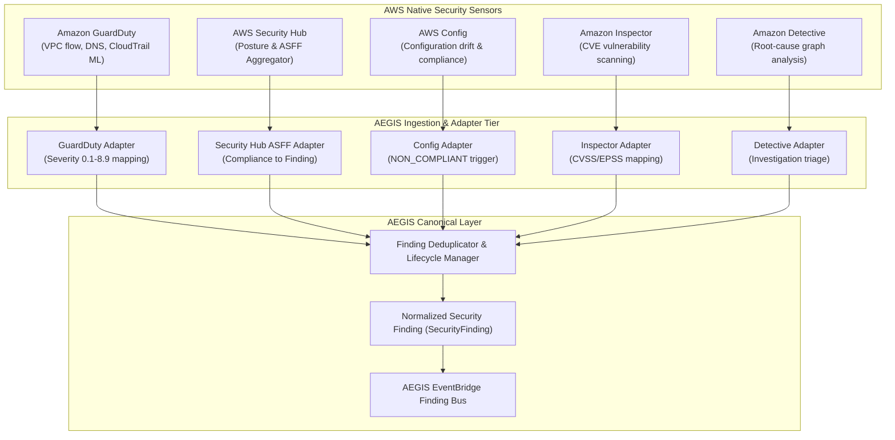

# AWS-Native Security Services Integration Guide
## GuardDuty, Security Hub, Config, Inspector & Detective in Project AEGIS

### 1. Architectural Role

AEGIS does not reinvent the wheel for standard cloud security detections. Instead, it aggregates, normalizes, and correlates findings from AWS's native detection services into a unified internal finding schema (`SecurityFinding`).

---

### 2. Service Analysis: Capabilities, Delivery & Blind Spots

#### 2.1 Amazon GuardDuty
- **What It Detects**:
  - Compromised IAM credentials (e.g. `UnauthorizedAccess:IAMUser/InstanceCredentialExfiltration`, `TorIPCaller`).
  - Known command-and-control (C2) IP communications via DNS/VPC flow logs.
  - S3 anomalous API calls (unusual geo-location, rapid data downloads).
  - Cryptomining activity on EC2 instances or ECS containers.
- **What AEGIS Receives**:
  - Detailed finding JSON via EventBridge with finding type, severity ($0.1 - 8.9$), resource details, and actor IP/ASN.
- **What It Does NOT Detect**:
  - Subtle business logic abuse or privilege escalation sequences that stay within normal statistical thresholds.
  - Application-level zero-days (e.g. SQL injection, SSRF) unless secondary network beacons occur.
  - Unmonitored regions or resources in accounts where GuardDuty is disabled.
- **Limitations**:
  - GuardDuty is largely post-compromise. It flags when exfiltration or C2 is *already occurring*, not when an initial misconfiguration is deployed.

#### 2.2 AWS Security Hub
- **What It Detects**:
  - Posture drift against benchmarks (CIS AWS Foundations, AWS FSBP, PCI DSS).
  - Consolidated findings from GuardDuty, Inspector, IAM Access Analyzer, and partner integrations.
- **What AEGIS Receives**:
  - AWS Security Finding Format (ASFF) JSON containing standard severity labels (`INFORMATIONAL`, `LOW`, `MEDIUM`, `HIGH`, `CRITICAL`), compliance check status (`PASSED`, `FAILED`), and remediation advice.
- **What It Does NOT Detect**:
  - Real-time API sequence attacks (evaluates periodic resource state scans, typically every 12-24 hours).
- **Limitations**:
  - Finding fatigue. Security Hub can generate thousands of informational compliance alerts that drown out active attack signals. AEGIS filters out low-severity non-exploitable compliance checks.

#### 2.3 AWS Config
- **What It Detects**:
  - Point-in-time configuration drift (e.g. S3 bucket policy changed to allow public read, security group ingress rule opened to `0.0.0.0/0`, IAM policy attached).
- **What AEGIS Receives**:
  - `Config Rules Compliance Change` events detailing the non-compliant resource, rule name, and previous configuration state.
- **What It Does NOT Detect**:
  - Ephemeral API attacks (e.g. an attacker creates an access key, downloads a secret, and deletes the key within 60 seconds may not trigger a periodic Config rule).
- **Limitations**:
  - Delivery delay (typically 2–15 minutes depending on recorder frequency).

#### 2.4 Amazon Inspector
- **What It Detects**:
  - Software vulnerabilities (CVEs) in EC2 packages, Lambda runtime dependencies, and container images in ECR.
  - Public network exposure paths to compute instances.
- **What AEGIS Receives**:
  - Inspector finding with CVSS v3 score, Exploit Prediction Scoring System (EPSS) score, affected package, and fixed version.
- **What It Does NOT Detect**:
  - Active exploitation of vulnerabilities; it only reports *presence* of vulnerable code.
- **Limitations**:
  - Static package database; zero-day vulnerabilities without assigned CVEs are invisible.

#### 2.5 Amazon Detective
- **What It Detects / Provides**:
  - Pre-built graph visual models correlating VPC flow logs, CloudTrail API calls, and GuardDuty findings across time windows.
- **What AEGIS Receives**:
  - Investigation links and root-cause summaries that AEGIS correlates with its Neptune IAM attack-path engine.
- **What It Does NOT Detect**:
  - Detective does not emit raw proactive alerts; it is an investigation acceleration tool.
- **Limitations**:
  - Requires at least 48 hours of historical telemetry before graph baselines become meaningful.

---

### 3. Normalized Severity Mapping Matrix

| Source | Raw Severity Value | AEGIS Normalized Severity |
|---|---|---|
| **GuardDuty** | $0.1 - 3.9$ | `LOW` |
| **GuardDuty** | $4.0 - 6.9$ | `MEDIUM` |
| **GuardDuty** | $7.0 - 8.9$ | `HIGH` |
| **GuardDuty** | $\ge 9.0$ (Critical extensions) | `CRITICAL` |
| **Security Hub** | `INFORMATIONAL` | `INFORMATIONAL` |
| **Security Hub** | `LOW` | `LOW` |
| **Security Hub** | `MEDIUM` | `MEDIUM` |
| **Security Hub** | `HIGH` | `HIGH` |
| **Security Hub** | `CRITICAL` | `CRITICAL` |
| **AWS Config** | `NON_COMPLIANT` (High Impact Rule) | `HIGH` |
| **AWS Config** | `NON_COMPLIANT` (Standard Rule) | `MEDIUM` |
| **Inspector** | CVSS $< 4.0$ | `LOW` |
| **Inspector** | CVSS $4.0 - 6.9$ | `MEDIUM` |
| **Inspector** | CVSS $7.0 - 8.9$ | `HIGH` |
| **Inspector** | CVSS $\ge 9.0$ or High EPSS ($>0.5$) | `CRITICAL` |
