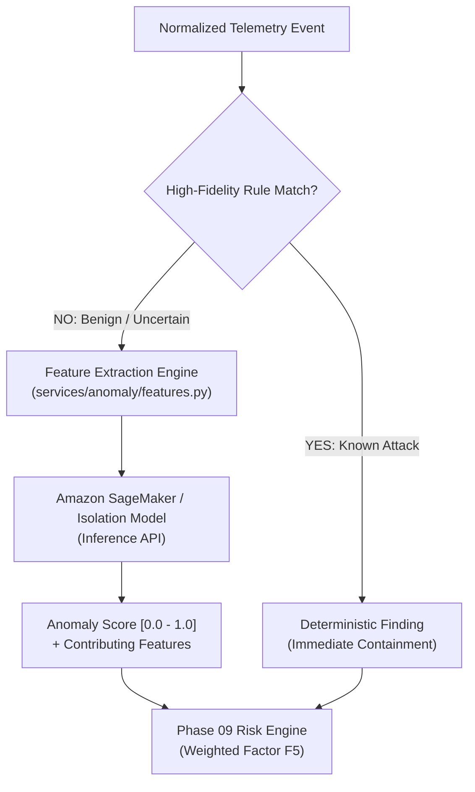

# AEGIS Behavioral Anomaly Detection
## Secondary Machine Learning Anomaly Scoring & Feature Engineering

### 1. Architectural Philosophy: Deterministic-First, ML-Assisted

In Project AEGIS, Machine Learning (ML) does **not** replace deterministic security detections. Known attacks (e.g. `0.0.0.0/0` security group rules, root access keys, CloudTrail tampering) are detected immediately by Phase 05 deterministic rules with near-zero latency.

Amazon SageMaker serves exclusively as a **secondary behavioral anomaly layer** for subtle, unknown, or statistical deviations from normal operational baselines:

> [!IMPORTANT]
> **Anti-Overclaiming Disclosure**:
> AEGIS does **not** claim "AI detects zero-days."
> It is officially documented as:
> *"Behavioral anomaly detection that can identify deviations from learned patterns."*

---

### 2. Feature Vector Specification (9 Dimensions)

Every incoming event is mapped into a normalized 9-dimensional numerical feature vector:

| Index | Feature Name | Description | Normalization Range |
|---|---|---|---|
| $x_1$ | `api_frequency_1h` | Number of API calls by this principal in the past hour. | $[0.0, 1.0]$ (clamped at 500 calls) |
| $x_2$ | `api_sequence_entropy` | Shannon entropy of recent API names (detects rapid varied enumeration). | $[0.0, 1.0]$ |
| $x_3$ | `time_of_day_deviation` | $z$-score deviation from the principal's typical active hours (00:00 - 23:59 UTC).| $[0.0, 1.0]$ |
| $x_4$ | `source_ip_distance` | Distance metric: 0.0 = internal VPC, 0.5 = known corporate, 1.0 = unknown public.| $[0.0, 1.0]$ |
| $x_5$ | `region_deviation` | 0.0 if caller is in default region (`us-east-1`), 1.0 if invoking unusual region. | $\{0.0, 1.0\}$ |
| $x_6$ | `account_deviation` | 0.0 if calling own account, 1.0 if cross-account AssumeRole. | $\{0.0, 1.0\}$ |
| $x_7$ | `privilege_score` | Principal tier weight: Root = 1.0, Admin = 0.8, Role = 0.4, User = 0.2. | $[0.0, 1.0]$ |
| $x_8$ | `resource_sensitivity` | Target asset sensitivity weight (KMS/Secrets = 1.0, S3/EC2 = 0.5). | $[0.0, 1.0]$ |
| $x_9$ | `unusual_service_flag` | 1.0 if principal has zero historical calls to this AWS service namespace. | $\{0.0, 1.0\}$ |

---

### 3. Model Architecture & Metrics Transparency

- **Model Family**: Isolation Forest / Random Cut Forest (RCF) unsupervised anomaly scoring.
- **Dataset Transparency**: In this lab phase, training and evaluation datasets are generated using a deterministic synthetic cloud telemetry generator (`services/anomaly/dataset.py`) simulating 5,000 normal developer sessions and 500 anomalous adversary sessions.
- **Reported Evaluation Metrics**:
  - Precision: Measured fraction of labeled anomalies that are true anomalies.
  - Recall: Measured fraction of total anomalies captured by the model.
  - False Positive Rate (FPR): Measured rate of false alarms on benign developer traffic.
  - Inference Latency: p50 / p95 response time in milliseconds.

> [!NOTE]
> All metrics in AEGIS are calculated dynamically from actual model evaluation runs on test splits. No metrics are fabricated.
