# AEGIS Custom Detection Engine
## Custom Behavioral and Sequence-Based Cloud Security Detection

### 1. Engine Philosophy & Overview

The AEGIS Custom Detection Engine is an explainable, deterministic, sequence-aware security analysis framework implemented in Python. 

> [!IMPORTANT]
> This engine does **not** claim to detect all zero-day attacks. It is formally described as:
> **"Custom behavioral and sequence-based cloud security detection."**

```mermaid
flowchart LR
    Telemetry["Normalized Event\n(NormalizedSecurityEvent)"] --> Enricher["Event Enricher\n(Identity, Account, Resource)"]
    Enricher --> Evaluator["Rule Evaluator\n(Rule Registry)"]
    
    subgraph Rules["10 Core Detection Rules"]
        R1["001: IAM Key Creation"]
        R2["002: Key Misuse"]
        R3["003: Unusual AssumeRole"]
        R4["004: Privilege Escalation"]
        R5["005: Security Group 0.0.0.0/0"]
        R6["006: CloudTrail Tampering"]
        R7["007: S3 Public Policy Drift"]
        R8["008: Sensitive Secret Access"]
        R9["009: Cross-Account Role Abuse"]
        R10["010: Suspicious Sequence Engine"]
    end

    Evaluator --> Rules
    Rules --> Findings["Generated Security Finding\n(SecurityFinding)"]
```

---

### 2. Detection Rule Catalog

| Rule ID | Rule Name | MITRE ATT&CK | Default Severity | Confidence | Trigger Condition |
|---|---|---|---|---|---|
| **AEGIS-DET-001** | Suspicious IAM Access-Key Creation | T1078.004 | `HIGH` | 0.88 | `iam:CreateAccessKey` performed on/by non-deployer or root entity. |
| **AEGIS-DET-002** | Suspicious Access-Key Usage | T1078 | `HIGH` | 0.85 | API call using newly created key from non-corporate IP/unrecognized user-agent. |
| **AEGIS-DET-003** | Unusual AssumeRole | T1548 | `HIGH` | 0.82 | `sts:AssumeRole` from untrusted source or bypassing External ID. |
| **AEGIS-DET-004** | Privilege Escalation Indicator | T1098 | `CRITICAL` | 0.95 | `iam:AttachUserPolicy`, `iam:PutUserPolicy` granting `*` or admin permissions. |
| **AEGIS-DET-005** | Dangerous Security Group Ingress | T1562.007 | `CRITICAL` | 0.95 | Ingress rule added exposing port 22, 3389, or 0-65535 to `0.0.0.0/0`. |
| **AEGIS-DET-006** | CloudTrail Tampering Attempt | T1562.001 | `CRITICAL` | 0.98 | `cloudtrail:StopLogging`, `DeleteTrail`, or `UpdateTrail` invoked. |
| **AEGIS-DET-007** | S3 Security Configuration Modification | T1530 | `HIGH` | 0.90 | `s3:DeleteBucketPolicy`, `DeletePublicAccessBlock`, or permissive ACL. |
| **AEGIS-DET-008** | Suspicious Sensitive-Resource Access | T1552 | `HIGH` | 0.85 | `secretsmanager:GetSecretValue` or `ssm:GetParameter` from external IP. |
| **AEGIS-DET-009** | Cross-Account Role Abuse | T1078.004 | `HIGH` | 0.87 | Role assumed across account boundaries with mismatched trust relationship. |
| **AEGIS-DET-010** | Suspicious API-Call Sequence | T1078 / T1098 | `CRITICAL` | 0.95 | Multi-step sequence within 5 minutes: `CreateAccessKey` $\to$ `PutUserPolicy` $\to$ `GetSecretValue`. |

---

### 3. Enrichment Model

Before rules execute, events pass through `EventEnricher` which appends:
- **Account Tier**: Classifies the target AWS account (`PRODUCTION`, `SECURITY`, `LOG_ARCHIVE`, `DEVELOPMENT`, `SECURITY_LAB`).
- **Principal Privilege**: Flags if the acting principal is `ROOT`, `IAM_ADMIN`, `WORKLOAD_ROLE`, or `FEDERATED`.
- **Resource Sensitivity**: Flags high-value targets (e.g. S3 data vaults, KMS root keys, production VPCs).
- **Network Profile**: Flags if the source IP is RFC 1918 private, AWS internal, or public/untrusted.
