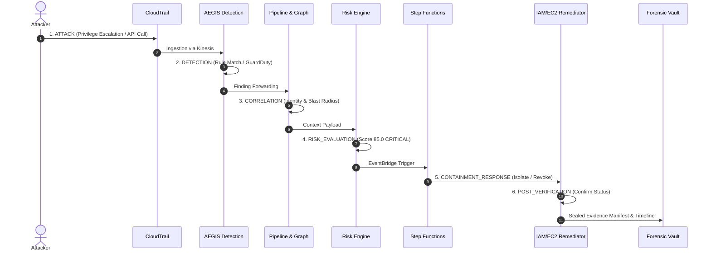

# Digital Forensics & Immutable Evidence Engine
## Project AEGIS - Phase 11 Architecture & Technical Specification

```
                   ┌─────────────────────────────────────────┐
                   │    Multi-Account Security Telemetry     │
                   └────────────────────┬────────────────────┘
                                        │
     ┌──────────────────┬───────────────┼───────────────┬──────────────────┐
     ▼                  ▼               ▼               ▼                  ▼
┌──────────┐     ┌─────────────┐ ┌─────────────┐ ┌─────────────┐    ┌─────────────┐
│CloudTrail│     │ SecurityHub │ │  IAM/EC2    │ │Remediation  │    │ Network Flow│
│  Record  │     │   Finding   │ │State Snap.  │ │  Action Log │    │  Telemetry  │
└────┬─────┘     └──────┬──────┘ └──────┬──────┘ └──────┬──────┘    └──────┬──────┘
     │                  │               │               │                  │
     └──────────────────┴───────────────┼───────────────┴──────────────────┘
                                        │
                                        ▼
                   ┌─────────────────────────────────────────┐
                   │   Evidence Collector & Hashing Engine   │
                   │    (Canonical JSON + SHA-256 Digest)    │
                   └────────────────────┬────────────────────┘
                                        │
                                        ▼
                   ┌─────────────────────────────────────────┐
                   │   S3 Forensic Evidence Vault            │
                   │   - KMS Customer Managed Key            │
                   │   - S3 Object Lock (Governance Mode)    │
                   │   - Strict Deny on s3:DeleteObject*     │
                   └────────────────────┬────────────────────┘
                                        │
                        ┌───────────────┴───────────────┐
                        ▼                               ▼
         ┌─────────────────────────────┐ ┌─────────────────────────────┐
         │     Amazon Athena Query     │ │    Amazon Detective Link    │
         │  Incident Chronology Table  │ │  Entity Graph Deep-Dive     │
         └─────────────────────────────┘ └─────────────────────────────┘
```

---

### 1. Cryptographic Chain-of-Custody & Evidence Sealing

AEGIS ensures non-repudiation and evidence integrity through canonical serialization and hierarchical SHA-256 hashing:

1. **Canonical Record Hashing**:
   Every captured artifact dictionary is serialized with lexicographically sorted keys and no non-essential whitespace:
   $$\text{Checksum} = \text{SHA256}\left(\text{JSON}_{\text{canonical}}(\text{raw\_data})\right)$$
2. **Cumulative Manifest Digest**:
   An `EvidenceManifest` aggregates all evidence items from an incident. The manifest digest seals the investigation:
   $$\text{ManifestDigest} = \text{SHA256}\left(\bigoplus_{i=1}^{M} \text{sort}\left(\text{Checksum}_i\right)\right)$$
3. **Tamper Detection**:
   Any unauthorized modification to any byte of telemetry or metadata immediately invalidates both the item digest and the master manifest seal.

---

### 2. S3 Object Lock Storage & Deletion Protection

Forensic artifacts are archived into an isolated S3 bucket protected with:
- **S3 Object Lock (Governance Mode)**: Enforces a mandatory retention window (default: 90 days). Objects cannot be overwritten, modified, or deleted even with elevated AWS credentials.
- **KMS Customer Managed Key Encryption**: Encrypted with customer-managed keys whose key policies deny `kms:Decrypt` to workload IAM roles.
- **Strict Bucket Policy Denials**:
  ```json
  {
    "Sid": "DenyEvidenceDeletion",
    "Effect": "Deny",
    "Principal": "*",
    "Action": [
      "s3:DeleteObject",
      "s3:DeleteObjectVersion"
    ],
    "Resource": "arn:aws:s3:::aegis-forensic-evidence-vault/*"
  }
  ```

---

### 3. Chronological Timeline Reconstruction

AEGIS automatically stitches telemetry across 6 distinct lifecycle stages:



#### Incident Metrics:
- **MTTD (Mean Time to Detect)**: \(\Delta t(\text{DETECTION} - \text{ATTACK})\)
- **MTTC (Mean Time to Contain)**: \(\Delta t(\text{POST\_VERIFICATION} - \text{DETECTION})\)
- **Total Duration**: \(\Delta t(\text{POST\_VERIFICATION} - \text{ATTACK})\)

---

### 4. Amazon Athena & Detective Investigation Layer

#### 4.1 Athena SQL DDL:
```sql
CREATE EXTERNAL TABLE IF NOT EXISTS aegis_forensics.evidence_records (
  evidence_id STRING,
  incident_id STRING,
  timestamp STRING,
  evidence_type STRING,
  source_service STRING,
  account_id STRING,
  region STRING,
  raw_data STRING,
  sha256_checksum STRING,
  retention_days INT
)
ROW FORMAT SERDE 'org.openx.data.jsonserde.JsonSerDe'
LOCATION 's3://aegis-forensics-vault-lab/incidents/';
```

#### 4.2 Detective Investigation URL:
For visual graph investigations, AEGIS generates deep links to the AWS Detective console:
`https://console.aws.amazon.com/detective/home?region=us-east-1#investigation/accounts/{account_id}/findings/{finding_id}`

---

### 5. Explicit Anti-Overclaiming & Forensic Scope

> [!IMPORTANT]
> **This engine provides immutable cloud incident evidence preservation and timeline reconstruction.**
>
> 1. It does NOT claim formal courtroom-grade forensic admissibility (e.g. ISO/IEC 27037 or Federal Rules of Evidence) without qualified legal chain-of-custody oversight and physical forensic acquisition.
> 2. Ephemeral EC2 RAM contents and kernel volatile state are not captured in S3 Object Lock unless dedicated memory dump agents (such as LiME or AWS Memory Dumper) are installed and executed prior to network isolation.
