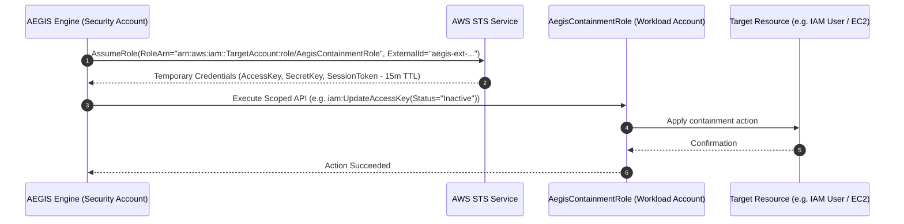

# AEGIS IAM Trust Model & Permissions Boundary
## Cross-Account Roles, STS Trust Relationships & Least-Privilege Design

### 1. Identity Architecture Overview

AEGIS operates from a centralized Security Account while monitoring and protecting multiple target Workload accounts (Production, Development, Security Lab).

Cross-account access relies exclusively on **STS AssumeRole** using cryptographic trust policies:
1. **No Long-Lived Access Keys**: No AWS Access Key ID / Secret pairs are deployed for cross-account communications.
2. **Confused Deputy Prevention**: Every cross-account role requires a cryptographic `sts:ExternalId` condition.
3. **Strict Separation of Audit vs Containment**:
   - `AegisAuditRole`: Read-only telemetry, configuration description, graph state ingestion.
   - `AegisContainmentRole`: Scoped exclusively to specific containment APIs (`iam:UpdateAccessKey`, `ec2:ModifyInstanceAttribute`, `s3:PutPublicAccessBlock`).

---

### 2. Role Specifications

#### 2.1 Security Account Engine Role (`AegisSecurityEngineRole`)
- **Location**: Security Account.
- **Assumed by**: Lambda functions and Step Functions tasks in the Security Account.
- **Permissions**:
  - `sts:AssumeRole` on `arn:aws:iam::*:role/AegisAuditRole` and `arn:aws:iam::*:role/AegisContainmentRole`.
  - Read/Write to AEGIS Kinesis Stream, DynamoDB finding table, and S3 evidence bucket.
  - KMS Decrypt/GenerateDataKey on AEGIS CMK.

#### 2.2 Workload Audit Role (`AegisAuditRole`)
- **Location**: All Member Accounts (Production, Development, Lab, Log Archive).
- **Trust Policy**:
  - Principal: `arn:aws:iam::<SecurityAccountId>:role/AegisSecurityEngineRole`
  - Condition: `StringEquals: { "sts:ExternalId": var.aegis_external_id }`
- **Managed Policies**:
  - `arn:aws:iam::aws:policy/SecurityAudit`
  - Scoped read permissions for VPC Flow Logs and Route 53 Resolver configurations.

#### 2.3 Workload Containment Role (`AegisContainmentRole`)
- **Location**: Workload Accounts (Production, Development, Security Lab).
- **Trust Policy**:
  - Principal: `arn:aws:iam::<SecurityAccountId>:role/AegisSecurityEngineRole`
  - Condition: `StringEquals: { "sts:ExternalId": var.aegis_external_id }`
- **Permission Boundary**:
  - All actions must fall within `AegisRemediationPermissionBoundary`.
- **Allowed Actions**:
  - `iam:UpdateAccessKey`, `iam:PutUserPolicy`, `iam:DeleteUserPolicy`, `iam:PutRolePolicy`
  - `ec2:ModifyInstanceAttribute`, `ec2:DescribeInstances`, `ec2:CreateSnapshot`
  - `s3:PutBucketPolicy`, `s3:PutPublicAccessBlock`, `s3:GetBucketPolicy`
- **Explicit Denials**:
  - Cannot create new IAM users, roles, or policies.
  - Cannot modify CloudTrail, GuardDuty, or Security Hub.
  - Cannot delete S3 buckets or KMS keys.
