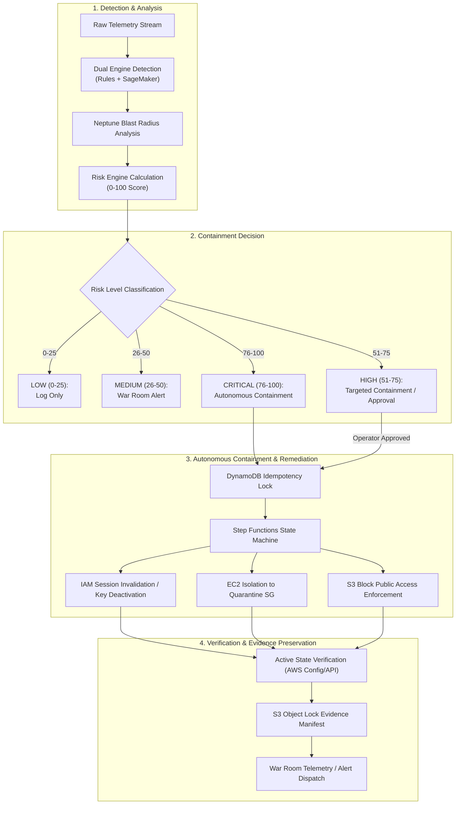

# AEGIS Incident Response Framework
## Autonomous Cloud Incident Response & Self-Healing Lifecycle

### 1. Response Framework Overview

Project AEGIS adapts the **NIST SP 800-61 Rev. 2** Computer Security Incident Handling Guide to autonomous cloud infrastructure. While traditional incident response (IR) relies on human triage taking hours or days, AEGIS executes containment within seconds for high-confidence threats while preserving cryptographic evidence for post-incident review.

---

### 2. Response Tiers & Containment Matrix

| Level | Risk Score | Auto Actions Executed | Verification Step | Reversibility |
|---|---|---|---|---|
| **LOW** | 0 – 25 | Record event in DynamoDB finding cache. No remediation. | N/A | N/A |
| **MEDIUM** | 26 – 50 | Emit EventBridge notification. Populate War Room alert queue. | Finding status logged | N/A |
| **HIGH** | 51 – 75 | Pre-stage containment payload. Trigger operator Slack/War Room approval gate. | Operator confirmation | Fully reversible via operator rollback command |
| **CRITICAL** | 76 – 100 | **Autonomous Containment**: Invalidate active session policy, disable compromised access key, detach dangerous SG rules. | Query AWS API to confirm resource state transition | Rollback state logged; configuration backup preserved |
| **EXTREME** | Account Compromise | Quarantine account by attaching zero-trust SCP; isolate VPC peering. (Security Lab default). | SCP attachment check | Requires human break-glass authorization to restore |

---

### 3. Containment Mechanics by Resource Type

#### 3.1 IAM Identity Containment
- **Target**: Compromised IAM User or Assumed Role.
- **Action**:
  1. Call `iam:UpdateAccessKey` to set `Status=Inactive` on active access keys.
  2. Call `iam:PutUserPolicy` to attach an inline quarantine policy `DenyAllActions` denying `*` on `*`.
  3. Set role revocation timestamp using `iam:PutRolePolicy` with `aws:CurrentTime < [Timestamp]` condition where supported.
- **Limitation**: Already-issued STS session tokens cannot be deleted from AWS backend without an explicit deny policy referencing `aws:TokenIssueTime` condition.

#### 3.2 Compute (EC2) Isolation
- **Target**: Compromised EC2 instance communicating with command-and-control (C2) IPs or exhibiting cryptomining signatures.
- **Action**:
  1. Capture metadata, current security group IDs, and network interfaces.
  2. Disassociate existing security groups and associate a pre-provisioned `aegis-quarantine-sg` which contains:
     - 0 ingress rules.
     - 0 egress rules (or strictly restricted egress to a forensic collection endpoint).
  3. Create an EBS snapshot of all attached volumes for digital forensics.
- **Verification**: Query `ec2:DescribeInstances` to verify only the quarantine security group is bound.

#### 3.3 Storage (S3) Protection
- **Target**: S3 bucket misconfigured with public read/write permissions or permissive ACLs.
- **Action**:
  1. Call `s3:PutPublicAccessBlock` setting all 4 flags to `true` (`BlockPublicAcls`, `IgnorePublicAcls`, `BlockPublicPolicy`, `RestrictPublicBuckets`).
  2. Inspect and strip dangerous `Principal: "*"` statements from the bucket policy.
- **Verification**: Call `s3:GetPublicAccessBlock` to confirm enforcement.

---

### 4. Idempotency & Failure-Safe Design

1. **Distributed Lock Table**: Before executing any containment action, the Step Functions state machine attempts a conditional `attribute_not_exists(incident_id)` write to the DynamoDB `AegisIdempotencyLocks` table with a 15-minute TTL.
2. **Duplicate Suppression**: Duplicate events arriving from Kinesis or EventBridge within the lock window are acknowledged and discarded without re-triggering remediation.
3. **Safe Failure & Rollback**: If a remediator fails mid-execution (e.g. AWS API throttling), the state machine executes an error handler branch:
   - Captures failure diagnostics.
   - Emits an urgent high-priority alarm.
   - Reverts partial configuration changes to the snapshot state captured before remediation.
