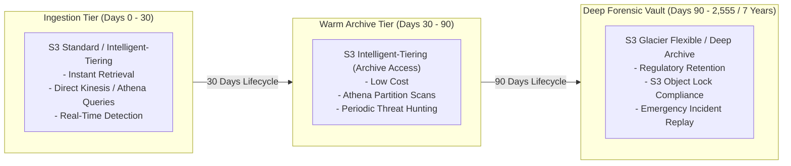

# AEGIS Log Retention & Lifecycle Architecture
## Storage Tiers, WORM Compliance & Lifecycle Policies

### 1. Retention Objectives & Legal Frameworks

Enterprise cloud security telemetry must balance long-term forensic and regulatory requirements (PCI DSS, HIPAA, SOC 2, ISO 27001) against S3 storage costs.

AEGIS implements a tiered storage architecture:



---

### 2. Telemetry Retention Schedule

| Telemetry Type | S3 Standard / Active | S3 Intelligent-Tiering | S3 Glacier Deep Archive | Total Retention | Destruction Mode |
|---|---|---|---|---|---|
| **CloudTrail Management Events** | 30 Days | 60 Days | 6.75 Years (2,465 Days) | **7 Years (2,555 Days)** | S3 Lifecycle Expiration (Automatic) |
| **CloudTrail S3 Data Events** | 14 Days | 16 Days | 335 Days | **1 Year (365 Days)** | S3 Lifecycle Expiration |
| **VPC Flow Logs** | 7 Days | 23 Days | 60 Days | **90 Days** | S3 Lifecycle Expiration |
| **Route 53 Resolver Logs** | 7 Days | 23 Days | 60 Days | **90 Days** | S3 Lifecycle Expiration |
| **AEGIS Security Findings** | 90 Days | 275 Days | 6 Years | **7 Years** | S3 Lifecycle Expiration |
| **Forensic Incident Evidence** | 365 Days | Indefinite | Indefinite | **Indefinite (Legal Hold)** | Manual Legal Hold release only |

---

### 3. S3 Lifecycle Rule Configuration

The centralized log vault bucket enforces the following automated transition rule:

```json
{
  "Rules": [
    {
      "ID": "aegis-telemetry-tiering-and-archive",
      "Status": "Enabled",
      "Filter": { "Prefix": "AWSLogs/" },
      "Transitions": [
        {
          "Days": 30,
          "StorageClass": "INTELLIGENT_TIERING"
        },
        {
          "Days": 90,
          "StorageClass": "GLACIER"
        }
      ],
      "NoncurrentVersionTransitions": [
        {
          "NoncurrentDays": 30,
          "StorageClass": "GLACIER"
        }
      ],
      "NoncurrentVersionExpiration": {
        "NoncurrentDays": 365
      }
    }
  ]
}
```
