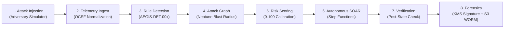

# AEGIS MITRE ATT&CK Matrix & Cloud Defense Coverage

## Overview

Project AEGIS maps every detection rule, telemetry stream, blast-radius query, and automated containment action directly to the **MITRE ATT&CK® Enterprise Matrix (Cloud Matrix v14)**.

This document details the operational coverage, detection telemetry, automated remediation, and automated test validation status across all mapped techniques.

---

## 1. Mapped MITRE ATT&CK Cloud Techniques

| Technique ID | Technique Name | Tactic | Detection Rule | Telemetry Source | Automated Containment | Test Status |
| :--- | :--- | :--- | :--- | :--- | :--- | :---: |
| **T1078.004** | Valid Accounts: Cloud Accounts | Initial Access, Persistence | `AEGIS-DET-001` | CloudTrail (`CreateAccessKey`) | `DEACTIVATE_ACCESS_KEY` | :white_check_mark: Automated |
| **T1071.001** | Application Layer Protocol: Web Protocols | Command and Control | `AEGIS-DET-002` | VPC Flow Logs + CloudTrail | `ISOLATE_EC2_INSTANCE` | :white_check_mark: Automated |
| **T1548** | Abuse Elevation Control Mechanism | Privilege Escalation | `AEGIS-DET-003` | CloudTrail (`AssumeRole`) | `REVOKE_IAM_SESSIONS` | :white_check_mark: Automated |
| **T1098** | Account Manipulation | Persistence, Privilege Escalation | `AEGIS-DET-004` | CloudTrail (`AttachUserPolicy`) | `ATTACH_QUARANTINE_BOUNDARY` | :white_check_mark: Automated |
| **T1562.001** | Impair Defenses: Disable Cloud Security | Defense Evasion | `AEGIS-DET-005` | CloudTrail (`AuthorizeSecurityGroupIngress` 0.0.0.0/0) | `REVOKE_SECURITY_GROUP_INGRESS` | :white_check_mark: Automated |
| **T1562.008** | Impair Defenses: Disable Cloud Logs | Defense Evasion | `AEGIS-DET-006` | CloudTrail (`StopLogging`, `DeleteTrail`) | `REVOKE_IAM_SESSIONS` | :white_check_mark: Automated |
| **T1530** | Data from Cloud Storage Object | Exfiltration, Impact | `AEGIS-DET-007` | CloudTrail (`DeleteBucketPolicy`, `PutPublicAccessBlock`) | `ENFORCE_S3_BLOCK_PUBLIC` | :white_check_mark: Automated |
| **T1110** | Brute Force: Password Spraying | Credential Access | `AEGIS-DET-008` | GuardDuty (`UnauthorizedAccess:IAMUser/ConsoleLoginSuccess.Unusual`) | `REVOKE_IAM_SESSIONS` | :white_check_mark: Automated |
| **T1484.002** | Domain Policy Modification: Trust Modification | Lateral Movement | `AEGIS-DET-009` | CloudTrail (`UpdateAssumeRolePolicy`) | `QUARANTINE_ACCOUNT` (Dual-Auth) | :white_check_mark: Automated |
| **T1584.004** | Compromise Infrastructure: Serverless | Execution, Persistence | `AEGIS-DET-010` | CloudTrail (Rapid API Sequence) | `ATTACH_QUARANTINE_BOUNDARY` | :white_check_mark: Automated |

---

## 2. End-to-End Attack-to-Containment Lifecycles

Each technique is codified into an automated purple-team validation scenario (`services/attack_lab/scenarios.py`) executing the complete 8-stage loop:



---

## 3. Continuous Verification via Replay Engine

All 8 scenarios are continuously tested in CI/CD and verifiable via the replay CLI:

```bash
# Replay all mapped techniques and verify post-conditions
python scripts/aegis_replay.py --scenario all --mode dry-run
```
