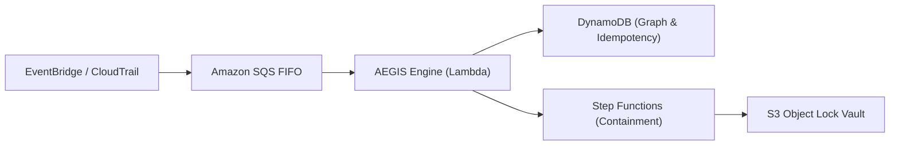

# AEGIS Lite — Single-Account Minimal Deployment Quick Start

## Overview

While the full Project AEGIS enterprise architecture is designed for multi-account AWS Organizations, **AEGIS Lite** enables individual developers, security researchers, and lean engineering teams to deploy a complete autonomous detection and self-healing defense pipeline within a **single AWS account** in under **15 minutes** for **under $20/month**.



---

## 1. Architecture Simplifications in AEGIS Lite

| Component | Multi-Account Enterprise Full | AEGIS Lite (Single Account) |
| :--- | :--- | :--- |
| **Accounts** | 5 Accounts (Mgmt, Sec, Log, Prod, Lab) | **1 Account** (Local or Sandbox) |
| **Graph Database** | Amazon Neptune Serverless ($73+/mo) | **Amazon DynamoDB Single-Table** ($2–5/mo) |
| **Anomaly Engine** | SageMaker Serverless Inference ($20+/mo) | **In-Process Lambda Centroid Scorer** ($0) |
| **Telemetry Bus** | Kinesis Data Streams ($11–50/mo) | **Amazon SQS FIFO** ($0.40/million events) |
| **Evidence Vault** | Cross-Account S3 Object Lock | **Local Account S3 Object Lock** |
| **Monthly Cost** | ~$250 – $1,800 / month | **~$15 – $25 / month** |

---

## 2. Prerequisites

- An active AWS Account.
- [AWS CLI v2](https://aws.amazon.com/cli/) configured with `AdministratorAccess` (or equivalent power user role).
- [Terraform](https://www.terraform.io/) >= 1.8 installed.
- Python >= 3.12 installed.

---

## 3. Step-by-Step Deployment (15 Minutes)

### Step 1: Clone Repository & Set Environment
```bash
git clone https://github.com/ShyamD2/aegis-cloud-security.git
cd aegis-cloud-security
python -m venv .venv
# On Windows:
.\.venv\Scripts\Activate.ps1
# On Linux / macOS:
source .venv/bin/activate
pip install -r requirements.txt
```

### Step 2: Configure Safe Default Remediation Mode
To ensure zero accidental disruption to existing workloads, AEGIS operates in `RECOMMENDATION` mode by default:
```bash
# Windows PowerShell:
$env:AEGIS_REMEDIATION_MODE="RECOMMENDATION"

# Linux / Bash:
export AEGIS_REMEDIATION_MODE="RECOMMENDATION"
```

### Step 3: Initialize & Deploy Terraform Lite Module
```bash
cd terraform/environments/dev
terraform init
terraform apply -var="enable_neptune=false" -var="enable_sagemaker=false" -auto-approve
```

### Step 4: Verify Deployment with Attack Replay
Run an automated dry-run attack replay to verify that EventBridge, Lambda detection rules, risk scoring, and evidence sealing are operating successfully:
```bash
cd ../../..
python scripts/aegis_replay.py --scenario 1 --mode dry-run
```

Expected output:
```
[AEGIS] PROJECT AEGIS -- ATTACK REPLAY & VERIFIED RESPONSE ENGINE
Scenario:          SCENARIO-01 — IAM Credential Compromise & Key Generation
Detection Engine:  PASS  [Rule: AEGIS-DET-001]
Risk Engine:       PASS  [Score: 80.5/100]
SOAR Containment:  PASS  [Mode: DRY-RUN]
Forensic Seal:     PASS  [KMS RSASSA-PSS Signature + S3 COMPLIANCE]
FINAL RESULT:      VERIFIED
```

---

## 4. Graduating to Enterprise Mode

When your organization is ready to expand to multi-account governance:
1. Enable `enable_neptune=true` and `enable_sagemaker=true` in `terraform/environments/prod/terraform.tfvars`.
2. Transition execution mode to active enforcement: `export AEGIS_REMEDIATION_MODE="ENFORCE"`.
3. Codify AWS Organizations root SCPs using `terraform/modules/organizations_scp/`.
