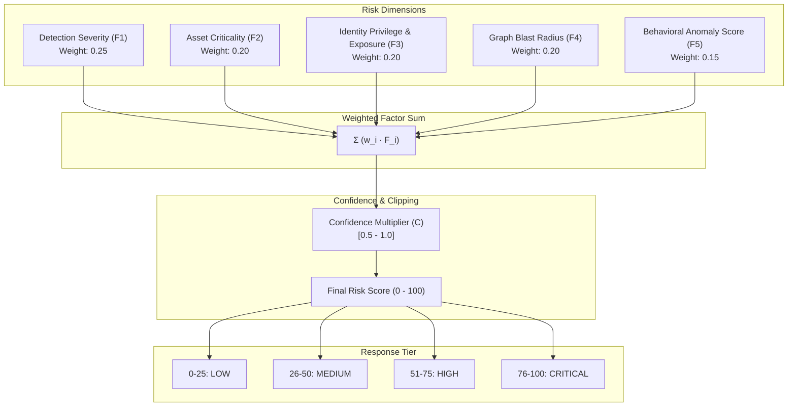

# AEGIS Security Risk Engine
## Mathematical Risk Model, Factor Weighting & Explainable Scoring

### 1. Purpose & Philosophy

The AEGIS Risk Engine evaluates the potential impact and likelihood of observed cloud events. Rather than relying on static vendor severity scores (e.g. "GuardDuty says High"), AEGIS computes a dynamic, contextual composite risk score from $0$ to $100$.

Every computed risk score must be **deterministic**, **configurable**, **unit-testable**, and **fully explainable**. The system generates a human-readable factor breakdown detailing exactly why a score was produced.

> [!IMPORTANT]
> This is an internal AEGIS scoring model designed to synthesize multi-dimensional cloud telemetry. It is not an official AWS standard or industry-mandated formula.

---

### 2. Composite Risk Formula

The composite risk score $R \in [0, 100]$ is calculated as a weighted sum of five core security dimensions, multiplied by a confidence multiplier:

$$R = \min\left(100, \; \text{round}\left( C \times \sum_{i=1}^{5} (w_i \cdot F_i) \right)\right)$$

Where:
- $C \in [0.5, 1.0]$: Detection confidence factor.
- $w_i$: Normalized factor weight ($\sum w_i = 1.0$).
- $F_i \in [0, 100]$: Normalized factor score.



---

### 3. Factor Definitions & Scoring Matrices

#### Factor 1: Detection Severity ($F_1$ - Weight: 0.25)
Mapped directly from the triggering rule or security finding:
- Informational / Low: $10 - 25$
- Medium: $26 - 50$
- High: $51 - 75$
- Critical: $76 - 100$

#### Factor 2: Asset Criticality ($F_2$ - Weight: 0.20)
Determined by asset tags (`Environment`, `DataClassification`), account type, and resource type:
- Development non-sensitive compute: $10 - 30$
- Production standard compute / internal S3: $50 - 70$
- Production PCI/HIPAA data store, KMS root key, or Secrets Manager: $90 - 100$

#### Factor 3: Identity Privilege & Exposure ($F_3$ - Weight: 0.20)
Derived from IAM permissions associated with the actor:
- Read-only standard IAM role: $10 - 30$
- PowerUser / Developer role with broad write permissions: $50 - 75$
- IAM Admin, FullAccess, or cross-account trust to management account: $85 - 100$

#### Factor 4: Graph Blast Radius ($F_4$ - Weight: 0.20)
Computed from Amazon Neptune graph traversal:
- Isolated resource with no cross-account trust or assume-role edges: $10 - 25$
- Identity can assume 1-3 roles with access to intermediate workloads: $40 - 65$
- Chained attack path reaches Production database or sensitive data vault: $85 - 100$

#### Factor 5: Behavioral Anomaly Score ($F_5$ - Weight: 0.15)
Inference score output by Amazon SageMaker behavioral model:
- Normal baseline activity: $0 - 20$
- Mild deviation (unusual hour, familiar IP range): $25 - 55$
- Severe deviation (unusual geolocation, rapid high-volume API sequence): $75 - 100$

---

### 4. Explainable Score Output Example

```json
{
  "incident_id": "inc-20260904-89a7f2",
  "calculated_risk_score": 88,
  "classification": "CRITICAL",
  "confidence": 0.95,
  "factors": {
    "detection_severity": {
      "score": 90,
      "weight": 0.25,
      "contribution": 22.5,
      "reason": "Suspicious API call sequence: CreateAccessKey followed by PutUserPolicy"
    },
    "asset_criticality": {
      "score": 85,
      "weight": 0.20,
      "contribution": 17.0,
      "reason": "Target environment is Production (Account: 111122223333)"
    },
    "identity_privilege": {
      "score": 95,
      "weight": 0.20,
      "contribution": 19.0,
      "reason": "Principal has iam:* and sts:AssumeRole permissions"
    },
    "blast_radius": {
      "score": 85,
      "weight": 0.20,
      "contribution": 17.0,
      "reason": "Graph traversal confirms assumable path to ProductionDataVaultRole"
    },
    "behavioral_anomaly": {
      "score": 80,
      "weight": 0.15,
      "contribution": 12.0,
      "reason": "Anomalous source IP (ASN: 4134, Geo: Non-standard), time-of-day z-score = 3.8"
    }
  },
  "recommended_response": "AUTONOMOUS_CONTAINMENT",
  "action": "Trigger Step Functions remediation: revoke access keys and attach quarantine deny policy."
}
```
