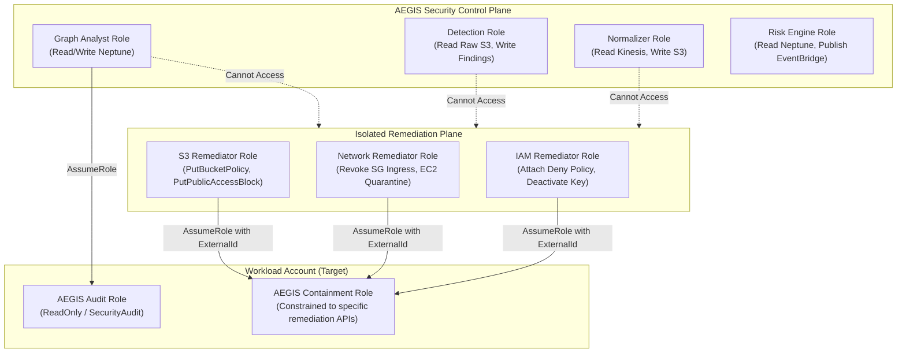
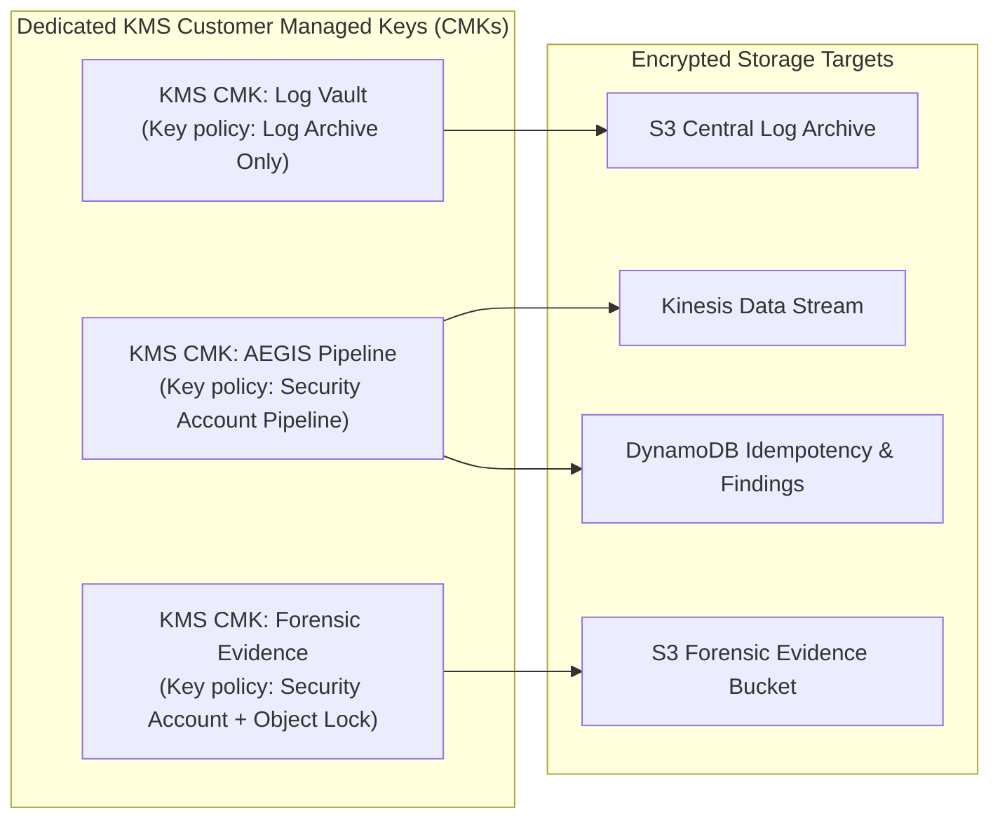

# AEGIS Security Model & Trust Boundaries
## Zero-Trust Architecture, Least-Privilege IAM & Data Protection

### 1. Security Architecture Principles

AEGIS adheres to strict defense-in-depth and zero-trust principles across all layers:

1. **Explicit Identity Verification**: Every service interaction is authenticated and authorized via AWS Signature Version 4 (SigV4) with short-lived STS credentials. No static access keys exist within the runtime environment.
2. **Strict Least Privilege**: IAM roles grant only the minimal set of API actions and resource ARNs required for the specific function. Wildcard actions (`*`) and administrator managed policies are prohibited.
3. **Separation of Concerns & Duties**: Detection, correlation, risk assessment, and active remediation are split across distinct Lambda execution roles. A compromised detection worker has zero permissions to alter security groups or revoke credentials.
4. **Service Control Policy (SCP) Guardrails**: Organizational guardrails provide immutable boundary conditions that prevent even root or admin credentials in workload accounts from tampering with logging, security detectors, or audit records.
5. **Cryptographic Protection at Rest & In Transit**: All inter-service communications enforce TLS 1.3. All persistent data stores (S3, DynamoDB, Neptune, Kinesis) enforce customer-managed AWS KMS keys (CMKs) with independent key administration.

---

### 2. IAM Delegation & Trust Model

Cross-account execution from the centralized Security Account to Workload accounts relies on scoped STS `AssumeRole` calls enforcing:
- **`sts:ExternalId`**: Guarding against the confused deputy problem.
- **Resource ARN scoping**: Bounded specifically to the target workload resources.
- **Permission Boundaries**: Attached to target containment roles ensuring permissions cannot be escalated beyond the pre-approved containment scope.
- **Session Policies**: Narrowing the effective permissions of the assumed session on each call to the exact single action being executed (e.g. `ec2:AuthorizeSecurityGroupIngress` is never valid when executing a containment revocation).

---

### 3. Data Protection & Encryption Architecture

- **Log Archive Key**: Grants `kms:GenerateDataKey*` exclusively to the CloudTrail service principal, and `kms:Decrypt` to the Centralized Ingestion Service.
- **Forensic Evidence Key**: Encrypts evidence manifests in S3. Denies `kms:ScheduleKeyDeletion` and `kms:DisableKey` to prevent anti-forensic destruction.

---

### 4. Human Access & Emergency Break-Glass Controls

- **Break-Glass Procedures**: Production emergency access utilizes dedicated Break-Glass IAM roles requiring dual-authorization approval, triggering instantaneous CloudWatch alarms and high-priority PagerDuty alerts.
- **Console Access**: All operator access to the AWS Management Console requires FIDO2/WebAuthn hardware security keys with mandatory MFA enforcement.
