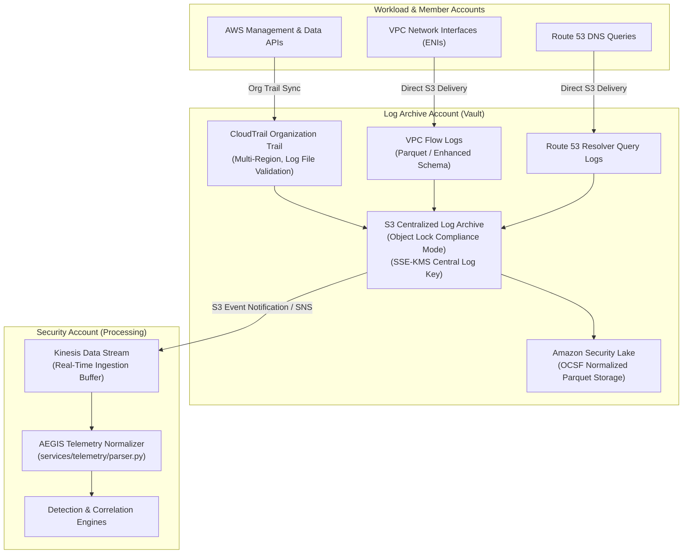

# AEGIS Centralized Security Telemetry Architecture
## Multi-Source Telemetry Ingestion, OCSF Alignment & Central Log Vault

### 1. Ingestion Architecture Overview

The Centralized Security Telemetry layer forms the sensory foundation ("eyes") of Project AEGIS. Telemetry from across all member accounts is ingested into an isolated, tamper-proof repository in the **Log Archive Account**, encrypted under a customer-managed KMS key, and streamed directly to the **Security Account** for real-time analysis.

---

### 2. Telemetry Sources & Schemas

#### 2.1 AWS CloudTrail (Organization Trail)
- **Scope**: All management events across all 6 accounts and all active regions.
- **Data Events**: Scoped specifically to security-critical resources:
  - S3 bucket data operations on `arn:aws:s3:::aegis-*` and production sensitive vaults.
  - AWS Lambda function invocations on remediation handlers.
- **Integrity**: Log file validation enabled. CloudTrail generates SHA-256 digest files every hour, enabling AEGIS to detect unauthorized log file modifications.

#### 2.2 Amazon VPC Flow Logs
- **Scope**: Captured at the VPC level across all workload subnets.
- **Aggregation Interval**: 1 minute (60 seconds) for near-real-time lateral movement and beaconing detection.
- **Custom Enriched Format**:
  `${version} ${account-id} ${interface-id} ${srcaddr} ${dstaddr} ${srcport} ${dstport} ${protocol} ${packets} ${bytes} ${start} ${end} ${action} ${log-status} ${tcp-flags} ${pkt-srcaddr} ${pkt-dstaddr}`
  - Captures true original IP before NAT traversal (`pkt-srcaddr`).
  - Captures TCP flags (`SYN`, `SYN-ACK`, `RST`, `FIN`) for port scanning and C2 beaconing analysis.

#### 2.3 Route 53 Resolver Query Logs
- **Scope**: Captured on all VPCs to identify malicious DNS queries (e.g. DNS tunneling, fast-flux domains, C2 communication).
- **Extracted Fields**: Query timestamp, client IP, domain queried, query type (`A`, `AAAA`, `TXT`), response code (`NOERROR`, `NXDOMAIN`), and DNS firewall action.

#### 2.4 Open Cybersecurity Schema Framework (OCSF) & Amazon Security Lake
- AEGIS normalizes all telemetry into canonical `NormalizedSecurityEvent` structures aligned with OCSF v1.1 standards, ensuring cross-vendor compatibility.

---

### 3. S3 Central Log Bucket Security Architecture

1. **WORM Immutability**: S3 Object Lock in **Compliance Mode** prevents object deletion even by the root account.
2. **KMS Envelope Encryption**: Encrypted with `alias/aegis-central-logs`. Workload accounts only possess `kms:GenerateDataKey*` permissions (write-only); decryption is restricted to the Security Account.
3. **Strict Bucket Policy**:
   - Denies any HTTP/non-TLS connections (`aws:SecureTransport = false`).
   - Denies `s3:DeleteObject` and `s3:DeleteBucket`.
   - Requires explicit `aws:SourceArn` for CloudTrail and Flow Log delivery service principals.
