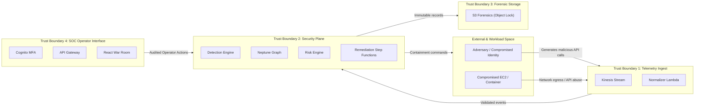

# AEGIS Threat Model
## STRIDE Analysis & Cloud Threat Modeling

### 1. Scope & System Boundaries

This threat model analyzes Project AEGIS, an autonomous AWS cloud security platform. The model covers:
- Ingestion of multi-account telemetry (CloudTrail, VPC Flow Logs, GuardDuty, Security Hub).
- Normalization and processing pipelines (Kinesis, Lambda, EventBridge).
- Contextual enrichment and storage (Neptune, DynamoDB, S3).
- Active response and containment mechanisms (Step Functions, IAM/EC2/S3 remediators).
- SOC Operator interfaces (API Gateway, Cognito, React Dashboard).

---

### 2. Attacker Profiles & Motivations

| Profile | Capability | Motivation | Targeted Vectors |
|---|---|---|---|
| **External Opportunist** | Automated scanning, exposed credentials | Resource hijacking (cryptomining), ransomware | Public S3 buckets, exposed IAM keys on GitHub |
| **Targeted APT** | Advanced IAM privilege escalation, cross-account pivoting, evasion | Intellectual property theft, persistent access | Long-lived credentials, AssumeRole chaining, log tampering |
| **Malicious Insider** | Legitimate existing credentials, workload permissions | Data exfiltration, sabotage | Abusing existing policy over-permissioning, modifying security groups |
| **Compromised Dependency / CI/CD**| Execution within deployment pipelines | Supply chain injection, secret extraction | GitHub Actions workflow poisoning, rogue Terraform commits |

---

### 3. STRIDE Threat Analysis

#### 3.1 Spoofing
- **Threat**: An adversary attempts to spoof CloudTrail events or inject synthetic benign records into Kinesis to mask active exploitation.
- **Mitigation**:
  - CloudTrail delivers directly to an isolated, dedicated Log Archive account S3 bucket using service principals with strictly scoped source ARNs (`aws:SourceArn` condition).
  - Telemetry ingestion into Kinesis enforces IAM authentication and VPC endpoint policies.
  - Event normalizers validate cryptographic digest files (`digest/`) generated by CloudTrail log file validation.

#### 3.2 Tampering
- **Threat**: An attacker who gains administrative rights attempts to disable CloudTrail, delete log files, disable GuardDuty, or modify AEGIS detection rules.
- **Mitigation**:
  - AWS Organizations Service Control Policies (SCPs) explicitly deny `cloudtrail:StopLogging`, `cloudtrail:DeleteTrail`, `guardduty:DeleteDetector`, and `s3:DeleteObject` across all workload accounts.
  - S3 Log and Forensic buckets enforce S3 Object Lock in **Compliance Mode** with multi-year retention.
  - AEGIS engine codebase and rules are cryptographically signed and deployed exclusively via secure CI/CD with branch protection.

#### 3.3 Repudiation
- **Threat**: An actor performs destructive operations and claims the actions were automated system processes or unlogged API calls.
- **Mitigation**:
  - Multi-region CloudTrail organization trail with AWS KMS customer-managed key (CMK) envelope encryption.
  - All automated remediation actions taken by AEGIS write an immutable JSON evidence manifest containing the triggering event ID, actor ARN, remediation target, execution timestamp, and SHA-256 state checksum to the forensics bucket.

#### 3.4 Information Disclosure
- **Threat**: Telemetry data containing sensitive parameters (API request parameters, PII, secret payloads) is leaked via logs or dashboard views.
- **Mitigation**:
  - Ingestion Lambda executes payload sanitization, masking known sensitive fields (e.g. `secretString`, `password`, `authorization` headers).
  - All data at rest in Kinesis, DynamoDB, S3, and Neptune is encrypted using AWS KMS with restricted key policies.
  - War Room API Gateway endpoints require Cognito JWT verification with role-based access control (RBAC).

#### 3.5 Denial of Service (DoS)
- **Threat**: An adversary floods AWS APIs with high-volume garbage events to exhaust Lambda concurrency, overwhelm Kinesis shards, or trigger throttles on security automation.
- **Mitigation**:
  - Kinesis stream auto-scaling and sharding with reserved Lambda concurrency limits.
  - DynamoDB idempotency cache with TTL ensures repeated duplicate events are dropped in sub-millisecond time.
  - Exponential backoff and jitter on all AWS API calls within remediation workers; DLQ capture for throttled events.

#### 3.6 Elevation of Privilege
- **Threat**: An attacker compromises an AEGIS component (e.g., normalizer Lambda or remediator Lambda) and attempts to abuse its permissions to escalate privilege across the organization.
- **Mitigation**:
  - **Zero Shared Admin Roles**: No component possesses `AdministratorAccess` or wildcard `*` IAM permissions.
  - **Segregated Remediators**: IAM Remediator can only modify specific permission boundaries and revoke keys; it cannot launch EC2 instances or alter S3 buckets.
  - Cross-account remediation roles in workload accounts require `sts:ExternalId` and enforce permission boundaries.

---

### 4. Trust Assumptions

1. **AWS Infrastructure Integrity**: The underlying AWS virtualization hypervisor, hardware, and physical data centers are assumed secure per the AWS Shared Responsibility Model.
2. **Management Account Security**: Access to the AWS Organizations Management account is strictly guarded by hardware multi-factor authentication (MFA) and break-glass procedures; root credentials are not used for routine operations.
3. **KMS Key Custody**: KMS key policies are maintained strictly within the Security and Log Archive accounts and cannot be modified by workload accounts.
